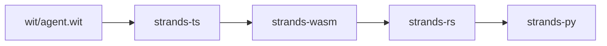
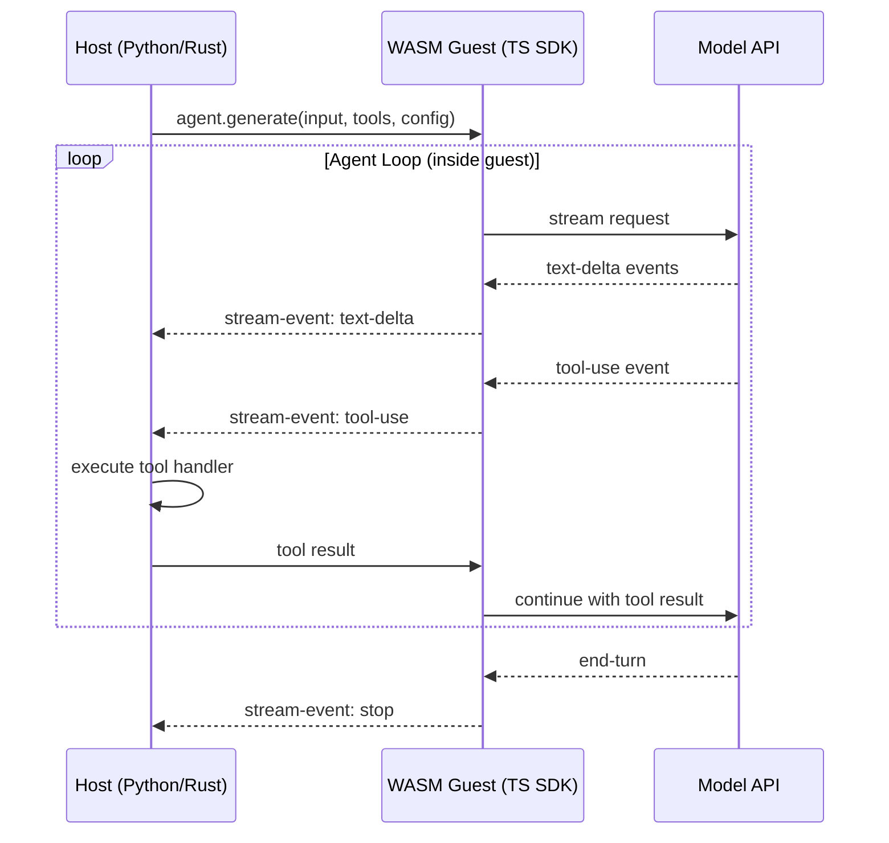

# Strands

Monorepo for the polyglot Strands agent SDK and the Filament execution kernel.

## Overview

The upstream Strands SDKs ([sdk-python](https://github.com/strands-agents/sdk-python), [sdk-typescript](https://github.com/strands-agents/sdk-typescript)) reimplement the agent loop, model providers, tool system, and streaming independently in each language. Each SDK ships 12+ model providers, MCP support, tool calling, and more, all written from scratch. This works well, but every new feature or integration costs N implementations for N languages.

This repo takes a different approach: define the agent interface once in WIT, implement it once in TypeScript, compile it to a WASM component, and host it from any language. New features ship to every language at the same time.

Both approaches are under active development. The polyglot SDK in this repo provides the core value today as a working cross-language agent runtime. Filament represents the direction things move in: a deterministic execution kernel that replaces the monolithic WASM component with a modular, event-sourced architecture.

### Upstream vs. This Repo

|                     | Upstream SDKs                                                 | This Repo                                         |
| ------------------- | ------------------------------------------------------------- | ------------------------------------------------- |
| **Approach**        | Native reimplementation per language                          | Single WASM component, thin host wrappers         |
| **Feature cost**    | N implementations for N languages                             | 1 implementation, available everywhere            |
| **Model providers** | 12+ per SDK (Bedrock, Anthropic, OpenAI, Gemini, Ollama, ...) | 4 (Bedrock, Anthropic, OpenAI, Gemini), growing   |
| **Maturity**        | Production, full-featured                                     | Experimental, functional                          |
| **Debugging**       | Native stack traces, language debuggers                       | WASM boundary adds indirection                    |
| **Ecosystem**       | Direct access to pip/npm packages                             | Tools cross the WASM boundary via `tool-provider` |

## Architecture



### Data Flow



The agent loop runs entirely inside the WASM guest. The host observes stream events and executes tool handlers when the model requests them.

## Packages

### Strands SDK

| Package                | Language   | What It Does                                                                                                                                                                                                                                |
| ---------------------- | ---------- | ------------------------------------------------------------------------------------------------------------------------------------------------------------------------------------------------------------------------------------------- |
| **wit/**               | WIT        | Agent interface contract and single source of truth. Defines stream events (text-delta, tool-use, tool-result, metadata, stop, error, interrupt), model configs (Anthropic, Bedrock), and the exported `agent`/`response-stream` resources. |
| **strands-ts/**        | TypeScript | Core SDK implementation. Contains the Agent class, model providers (Anthropic, Bedrock, OpenAI, Gemini), tool system (function tools, Zod tools, MCP), hooks, conversation management, and vended tools. About 25k lines.                   |
| **strands-wasm/**      | TS to WASM | Bridges the TS SDK to WIT exports via `entry.ts`, then compiles everything into a WASM component (~29MB) using esbuild and componentize-js.                                                                                                 |
| **strands-rs/**        | Rust       | WASM host. Embeds the AOT-precompiled component and runs it in Wasmtime with async support. Provides `AgentBuilder`, streaming, session persistence, and AWS credential injection. Has optional `pyo3` and `uniffi` features for FFI.       |
| **strands-py/**        | Python     | Python SDK. A PyO3 wrapper around `strands-rs` built via maturin. Adds the `Agent` class, `@tool` decorator with schema generation from type hints and docstrings, hooks, structured output (Pydantic), and hot tool reloading.             |
| **strands-derive/**    | Rust       | Proc macro crate. `#[derive(Export)]` generates PyO3/UniFFI wrapper types and `from_py_dict` extractors from WIT bindgen output.                                                                                                            |
| **strands-native-rs/** | Rust       | Standalone native Rust SDK with no WASM. Uses `anthropik` for direct Anthropic API access and `rmcp` for MCP. A simpler alternative when cross-language portability is not needed.                                                          |

### Filament

Filament is an event-sourced execution kernel that aims to solve the N-languages x M-integrations problem structurally. Instead of a monolithic WASM component, individual features (model adapters, tools, audio pipelines) become separate WASM modules that load into a managed runtime with sandboxing, virtual time, and capability-based security.

It is currently a working proof-of-concept with no integration into the Strands SDK. See the [0.2.0 spec](docs/filament-0.2.0.md) (outdated but directionally useful).

| Package               | Language   | What It Does                                                                                                                                                                             |
| --------------------- | ---------- | ---------------------------------------------------------------------------------------------------------------------------------------------------------------------------------------- |
| **filament-wit/**     | WIT        | Kernel interface. Defines the `plugin` resource (load/weave lifecycle), `channel` (pub/sub), `timer`, `logger`, `blob-store`, and `config` interfaces.                                   |
| **filament-core/**    | Rust       | Runtime kernel. Handles event-sourced execution with pipelines, plugins, and pluggable module loaders (Wasmtime native, browser). Manages weave cycles with virtual time.                |
| **filament-cli/**     | Rust       | Developer CLI. `filament new` scaffolds modules (Rust/TS/Python templates), `filament build` compiles to WASM with an embedded manifest, and `filament run` executes pipeline manifests. |
| **filament-sdk-rs/**  | Rust       | SDK for authoring Filament plugins in Rust. A thin wrapper around wit-bindgen output.                                                                                                    |
| **filament-sdk-js/**  | TypeScript | Generated type definitions for authoring Filament plugins in TypeScript.                                                                                                                 |
| **strands-filament/** | TypeScript | Example Filament module. Ping-pong plugins that demonstrate the lifecycle, channel communication, and timers.                                                                            |

### Tooling

| Package              | Language | What It Does                                                                      |
| -------------------- | -------- | --------------------------------------------------------------------------------- |
| **strands-metrics/** | Rust     | CLI for syncing GitHub org data (issues, PRs, commits, stars, CI runs) to SQLite. |
| **strands-grafana/** | Docker   | Grafana dashboards with a SQLite datasource for the metrics above.                |
| **docs/**            | Markdown | Architecture docs, Filament specs, and test guides.                               |
| **justfile**         | Just     | Build orchestration for the full pipeline.                                        |

## Quick Start

```bash
# Install all toolchains and dependencies
just setup

# Regenerate all language bindings from WIT
just generate

# Build everything: TS, WASM, Rust AOT, Python extension
just build

# Run tests per language
just test-ts
just test-rs
just test-py

# Run a Rust example (requires ANTHROPIC_API_KEY)
just example hello_strands

# Full CI pipeline
just ci
```

## License

Licensed under MIT or Apache-2.0.
