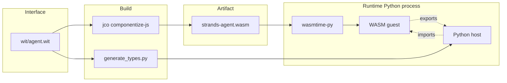
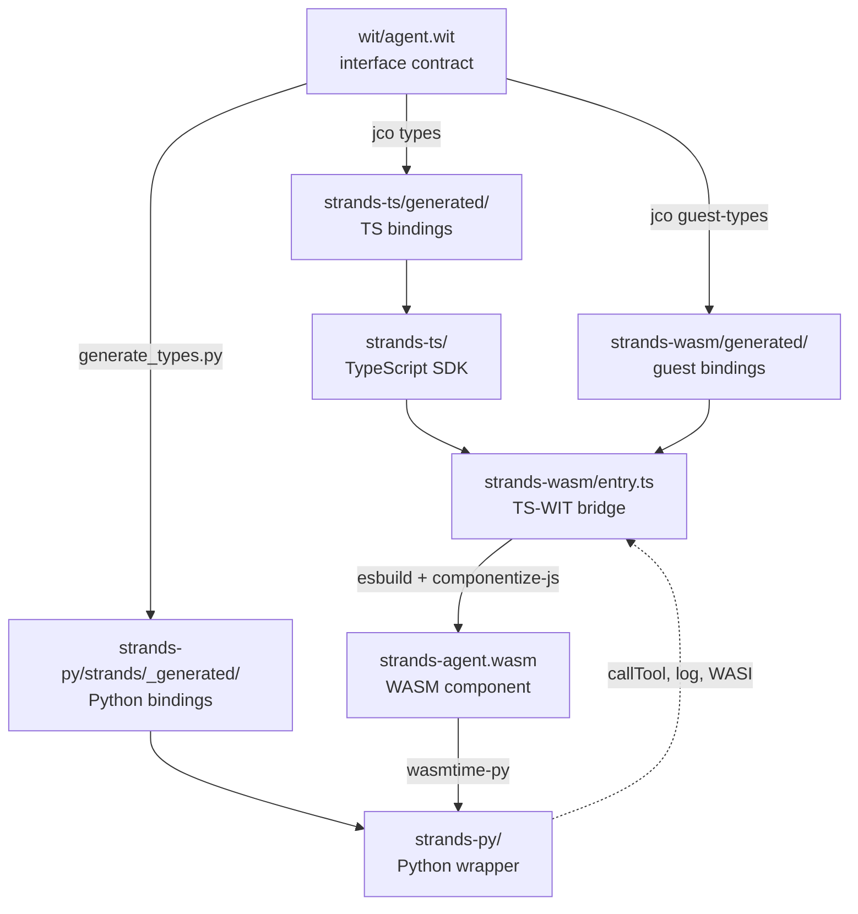

# WASM development demo day

## 1. What is WASM?

WebAssembly is a portable binary format with a typed interface and a
sandboxed execution model. It started in browsers but is now used as a
general-purpose "compile once, run anywhere" runtime. We compile the TS agent
runtime into a `.wasm` file and Python loads it. One runtime, every language.

The compiled binary can't touch the filesystem, network, or OS on its own. The Python side has to explicitly grant each capability by providing an _import_, a callback the binary can invoke.

In our setup Python provides two imports:

- `callTool` which runs a users python tool.
- `log` which forward a log line.

In addition to these, we give our sandbox access to the WASM system interface (WASI). Wasi gives our sandbox access to system functions such as network requests and filesystem access.

Anything else the binary wants to do, it can't. We own what our agent has access to, making it truly sandboxed.

### WIT: the interface contract

WIT describes the types and functions that cross the WASM boundary. It's language-neutral meaning every language can generate bindings from the same
file. WIT is the only thing that the TS SDK and every other SDK mutually depend on.

An abbreviated snippet from `wit/agent.wit`:

```wit
package strands:agent;

interface types {
  enum stop-reason {
    end-turn,
    tool-use,
    cancelled,
  }

  variant stream-event {
    text-delta(string),
    stop(stop-data),
  }
}

interface tool-provider {
  call-tool: func(args: call-tool-args) -> result<string, string>;
}

world agent {
  import tool-provider;   // Python implements this
  export api;             // TS implements this
}
```

Identifiers are kebab-case in WIT and get transformed per-language. A `world` describes a complete WASM component: what it imports from the host and what it exports to the host.

### wasmtime: the runtime

[wasmtime](https://wasmtime.dev/) is the engine that runs the WASM
component on the host side. On the Python side we use `wasmtime-py`, the Python
bindings for wasmtime.

What it does for us:

- Loads `strands-agent.wasm` from disk.
- Instantiates it with the host imports (our Python-side `callTool`, `log`).
- Enforces the sandbox: memory isolation, no ambient OS access, only the
  declared imports can cross the boundary.

Python never sees the raw WASM. It sees a generated Python class whose methods
forward into the component through wasmtime.

### How the pieces fit together



At build time, WIT is the input to both `jco` (which compiles the TS SDK into
`agent.wasm`) and `generate_types.py` (which produces the Python type stubs).
At run time, `wasmtime-py` loads the `.wasm`, wires Python's `callTool` and
`log` implementations in as imports, and the Python user calls into the guest
through the generated class.

---

## 2. Architecture at a glance



Every language calls the _same_ compiled `agent.wasm`. The WIT contract is the
only thing both sides depend on. Add a new model provider in TS, Python gets
it for free after a rebuild.

---

## 3. End-to-end: developing a feature

Feature: "add a new stop reason `rate-limited`."

| Step                                                                             | Layer       |
| -------------------------------------------------------------------------------- | ----------- |
| 1. Add `rate-limited` to the `stop-reason` enum in `wit/agent.wit`               | WIT         |
| 2. Regenerate bindings with `strandly generate`                                  | codegen     |
| 3. Emit the new reason from the TS agent loop in `strands-ts/src/agent/agent.ts` | TS          |
| 4. Map it in `strands-wasm/entry.ts::mapStopReasonTag`                           | TS          |
| 5. Rebuild the WASM component with `strandly build --wasm`                       | build       |
| 6. Add tests in `strands-ts/src/**/__tests__/` and `strands-py/tests_integ/`     | TS + Python |

A few things to note:

- The contract change (step 1) is the only place a schema decision lives. TS
  and Python bindings derive from WIT automatically.
- Step 4 is easy to forget. The `tsc --noEmit` gate in strands-wasm catches it
  as a compile error when the switch is exhaustive.

---

## 4. Debugging across languages

**Golden rule:** if TS works but Python misbehaves, the bug is almost certainly
in the bridge (`strands-wasm/entry.ts`) or the Python host glue
(`strands-py/strands/_wasm_host.py`), not in the TS SDK.

Typical scenarios:

### Tool call reaches Python, wrong arguments arrive

Tool inputs cross as JSON-encoded strings. Check `createTools` in `entry.ts`:
`input` is `JSON.stringify(input)` on the TS side and `JSON.parse(result)` on
return. A non-serializable value (`undefined`, `Function`, circular ref) from a
Python tool breaks this round-trip.

### TS unit tests pass, Python integration tests fail

Run the boundary tests (`npm run test:guest -w strands-wasm`) first. These
load the compiled `.wasm` with mocked Python imports and catch WIT-binding
mismatches that pure TS tests miss.

---

## 5. Build and distribution

```
strandly build
```

Runs in order:

1. `generate`: regenerates TS bindings from WIT.
2. `build --ts`: TypeScript compiler over `strands-ts/`.
3. `build --wasm`: esbuild bundles `entry.ts` + the SDK into a single ESM
   file, then `componentize-js` compiles it into `strands-agent.wasm`.
4. `build --py`: Python package install.

Output artifacts:

- `strands-ts/dist/`: npm package (`@strands-agents/sdk`).
- `strands-wasm/dist/strands-agent.wasm`: the component Python loads.
- `strands-py/dist/`: Python wheel.

---

## 6. Dev CLI

`strandly` orchestrates everything:

```
strandly <command> [--ts|--wasm|--py]
```

Most-used:

- `bootstrap`: first-time setup (install toolchains, generate bindings, build every layer).
- `validate <layer>`: rebuild and test the layers affected by a change. The
  magic command when you're not sure if a change is local or cross-layer.
- `ci`: the full pipeline, same thing CI runs.
- `rebuild`: clean rebuild when something is stale.

The `validate` command is the one to internalize:

| Changed                                        | Run                                   |
| ---------------------------------------------- | ------------------------------------- |
| WIT contract                                   | `validate wit` (rebuilds every layer) |
| TS SDK internals                               | `validate ts`                         |
| TS SDK public API (something entry.ts imports) | `validate ts-api`                     |
| WASM bridge (`entry.ts`)                       | `validate wasm`                       |
| Pure Python                                    | `validate py`                         |

---

## 7. Contributing: a live walkthrough

This section is the demo. We ship a real three-line fix end to end, watching
each layer respond. Follow along in a terminal.

The story fits the debugging rule: TS changed, Python diverged, the bridge
was the culprit.

### The bug

TS added `'interrupt'` as a new `StopReason` when the human-in-the-loop
feature landed (PR #784). The WASM bridge's `mapStopReasonTag` was never
updated. Result: when an agent stops due to an interrupt, Python sees
`stop_reason="error"` instead of `"interrupt"`. Silent data corruption across
the boundary.

Three lines fix it: one in WIT, two in the bridge.

### Setup (one time)

```bash
git clone https://github.com/strands-agents/sdk-typescript.git
cd sdk-typescript
git checkout chay/demo-day
npm install
npm run dev -- bootstrap   # only this one time: runs `npm link` which may prompt for sudo
```

`bootstrap` installs toolchains, generates bindings, and builds every layer.

It also symlinks `strandly` globally, so every command below runs bare.
The symlink points back at `strandly/src/cli.ts` in this working copy —
edits to the CLI take effect immediately with no re-link.

### Step 1: see the gap

TS SDK's StopReason union lives in `strands-ts/src/types/messages.ts`. Either
open that file or run:

```bash
grep -A 11 "^export type StopReason" strands-ts/src/types/messages.ts
```

```
export type StopReason =
  | 'cancelled'
  | 'contentFiltered'
  | 'endTurn'
  | 'guardrailIntervened'
  | 'interrupt'                      # added in #784
  | 'maxTokens'
  | 'stopSequence'
  | 'toolUse'
  | 'modelContextWindowExceeded'
  | (string & {})
```

WIT contract lives in `wit/agent.wit`. Either open that file or run:

```bash
grep -A 10 "enum stop-reason" wit/agent.wit
```

```
enum stop-reason {
  end-turn,
  tool-use,
  max-tokens,
  error,
  content-filtered,
  guardrail-intervened,
  stop-sequence,
  model-context-window-exceeded,
  cancelled,
  # no interrupt
}
```

Bridge mapping function lives in `strands-wasm/entry.ts` under
`mapStopReasonTag`. Either open that file or run:

```bash
grep -A 22 "function mapStopReasonTag" strands-wasm/entry.ts
```

```
function mapStopReasonTag(reason: StopReason): StopData['reason'] {
  switch (reason) {
    case 'endTurn': return 'end-turn'
    case 'toolUse': return 'tool-use'
    ...
    case 'cancelled': return 'cancelled'
    # no 'interrupt' case
    default: return 'error'            # 'interrupt' falls through here
  }
}
```

The bridge converts any unknown stop reason to `'error'`. That's where the bug
lives.

### Step 2: add the WIT variant

Open `wit/agent.wit`, find the `enum stop-reason { ... }` block near the top,
and add `interrupt,` as the last variant:

```
enum stop-reason {
  end-turn,
  tool-use,
  max-tokens,
  error,
  content-filtered,
  guardrail-intervened,
  stop-sequence,
  model-context-window-exceeded,
  cancelled,
  interrupt,
}
```

### Step 3: regenerate bindings

```bash
strandly generate
```

Python's bindings now carry the new variant. The generated file is
`strands-py/strands/_generated/types.py`. Either open it or run:

```bash
grep -A 13 "class StopReason" strands-py/strands/_generated/types.py
```

```
class StopReason(Enum):
    END_TURN = 0
    TOOL_USE = 1
    MAX_TOKENS = 2
    ERROR = 3
    CONTENT_FILTERED = 4
    GUARDRAIL_INTERVENED = 5
    STOP_SEQUENCE = 6
    MODEL_CONTEXT_WINDOW_EXCEEDED = 7
    CANCELLED = 8
    INTERRUPT = 9
```

Python code never changed. One WIT edit, both languages' bindings refreshed.

### Step 4: wire it in the bridge

Open `strands-wasm/entry.ts`, find `function mapStopReasonTag`, and add the
`case 'interrupt'` branch just before the `default`:

```
case 'cancelled':
  return 'cancelled'
case 'interrupt':
  return 'interrupt'
default:
  return 'error'
```

### Step 5: validate

WIT changed, so run the full cascade:

```bash
strandly validate wit
```

That rebuilds WIT bindings, TS, WASM, and runs TS tests. About 90 seconds.

### Step 6: see it work

Drop into the Python REPL with the new binding preloaded. The `-i` flag
leaves you at a `>>>` prompt after the script runs, so you can poke at the
enum live:

```bash
cd strands-py
.venv/bin/python -i -c "
from strands._generated.types import StopReason
for r in StopReason:
    print(f'  {r.name} = {r.value}')
"
```

```
  END_TURN = 0
  TOOL_USE = 1
  MAX_TOKENS = 2
  ERROR = 3
  CONTENT_FILTERED = 4
  GUARDRAIL_INTERVENED = 5
  STOP_SEQUENCE = 6
  MODEL_CONTEXT_WINDOW_EXCEEDED = 7
  CANCELLED = 8
  INTERRUPT = 9
>>> StopReason.INTERRUPT
<StopReason.INTERRUPT: 9>
>>>
```

`INTERRUPT = 9` is new. Before the WIT edit, the enum stopped at
`CANCELLED = 8`. The Python bindings picked up the new variant with no
Python-side change. Ctrl-D (or `exit()`) to leave the REPL.

For an end-to-end interrupt flow, see `strands-py/tests_integ/interrupts/`. Running those requires AWS credentials because they invoke Bedrock.

### What we just demonstrated

- One WIT edit, both languages updated. `interrupt` appeared in the Python
  enum from the same addition to `agent.wit`. This is the WIT-as-contract
  property.
- The bridge is where cross-language bugs live. Python was fine, TS was fine,
  the bridge's `mapStopReasonTag` silently swallowed the new variant.

---

## 8. Stretch: generated types for the TS SDK too?

The narrowing that tripped us up in the fix above (`if ('interrupt' in event)`
matching anything with an `.interrupt` property) wasn't isolated to the
bridge. It's the same pattern the TS SDK's public content-block types use,
today, in `strands-ts/src/types/messages.ts`:

```ts
// Today — hand-written in messages.ts.
// Discriminated by object key. Works via structural narrowing (`'text' in x`).
// Footgun: if any payload ever grows a field named `text`, `toolUse`, etc.,
// the narrowing silently breaks. Not idiomatic TS.

type ContentBlockData =
  | TextBlockData // { text: string }
  | { toolUse: ToolUseBlockData }
  | { toolResult: ToolResultBlockData }
  | { reasoning: ReasoningBlockData }
  | { cachePoint: CachePointBlockData }

function render(block: ContentBlockData) {
  if ('text' in block) return block.text
  if ('toolUse' in block) return block.toolUse.name
  if ('toolResult' in block) return block.toolResult.toolUseId
}
```

Switching to WIT-generated types fixes drift _and_ the narrowing bug in one
step. jco's output is the same tagged-union shape that every serious TS
discriminated-union library (neverthrow, ts-pattern, fp-ts Either) uses:

```ts
// WIT-generated: tagged `{tag, val}`.
// Explicit tag field, payload isolated under `val`. No narrowing tricks.
// Handles primitive payloads uniformly: `textDelta(string)` → {tag, val: string}.

type ContentBlock =
  | { tag: 'text'; val: TextBlock }
  | { tag: 'tool-use'; val: ToolUseBlock }
  | { tag: 'tool-result'; val: ToolResultBlock }
  | { tag: 'reasoning'; val: ReasoningBlock }
  | { tag: 'cache-point'; val: CachePointBlock }

function render(block: ContentBlock) {
  if (block.tag === 'text') return block.val.text
  if (block.tag === 'tool-use') return block.val.name
  if (block.tag === 'tool-result') return block.val.toolUseId
}
```

This is one example of the kind of breaking change WIT-as-truth enables.
