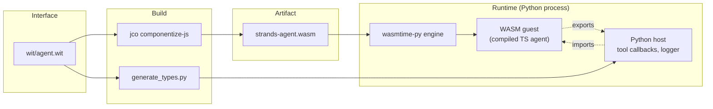
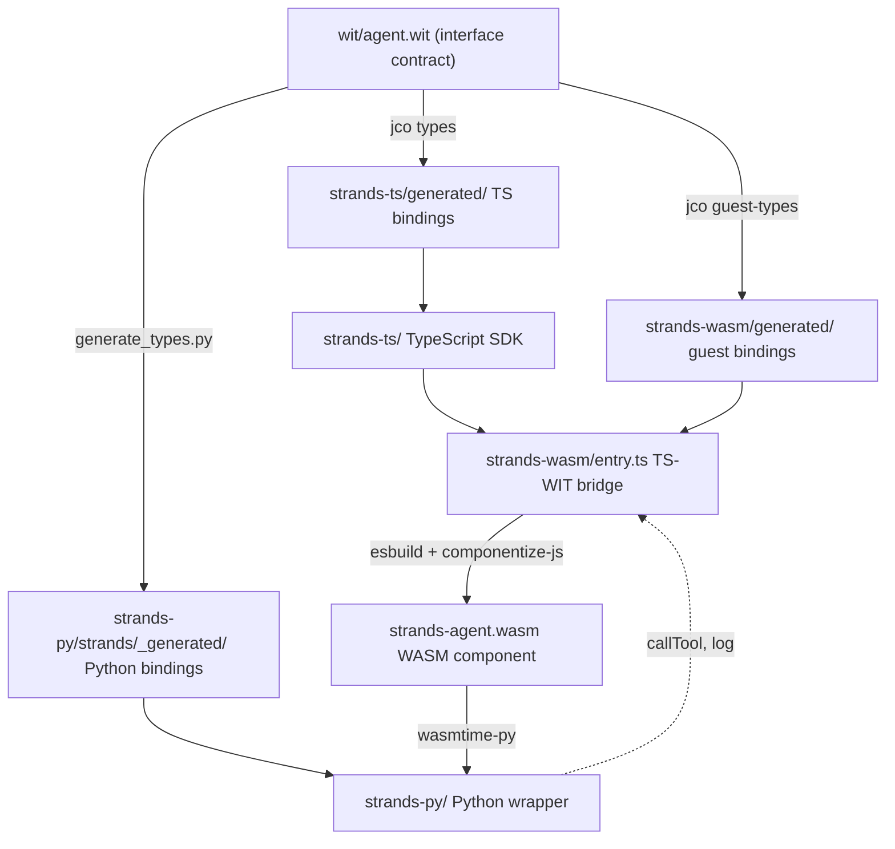

# Strands TS to Python via WASM: how it works

A walkthrough for the team. Each section has a concrete example.

---

## 1. What is WASM?

WebAssembly (WASM) is a portable binary format with a typed interface and a
sandboxed execution model. It started in browsers but is now used as a
general-purpose "compile once, run anywhere" runtime. We compile the TS agent
runtime into a `.wasm` file and Python loads it. One runtime, every language.

The compiled binary can't touch the filesystem, network, or OS on its own. The
Python side has to explicitly grant each capability by providing an *import*,
a callback the binary can invoke. In our setup Python provides two imports:
`callTool` (run a user's Python tool) and `log` (forward a log line). Anything
else the binary wants to do, it can't.

### WIT: the interface contract

WIT describes the types and functions that cross the WASM boundary. It's
language-neutral (Rust, Python, JS, Go all generate bindings from the same
file) and the only thing both sides depend on.

An abbreviated snippet from `wit/agent.wit`:

```wit
package strands:agent;

interface types {
  enum stop-reason {
    end-turn,
    tool-use,
    max-tokens,
    cancelled,
  }

  record tool-spec {
    name: string,
    description: string,
    input-schema: string,
  }

  variant stream-event {
    text-delta(string),
    tool-use(tool-use-event),
    stop(stop-data),
  }
}

interface tool-provider {
  call-tool: func(args: call-tool-args) -> result<string, string>;
}

world agent {
  import tool-provider;   // Python implements this
  export api;             // TS implements this
}
```

Identifiers are kebab-case in WIT and get transformed per-language (camelCase
in TS, snake_case in Python). A `world` describes a complete WASM component:
what it imports from the host and what it exports to the host.

### wasmtime: the runtime

[wasmtime](https://wasmtime.dev/) is the engine that actually *runs* the WASM
component on the host side. It's a Bytecode Alliance project, same org that
maintains WIT and `jco`. On the Python side we use `wasmtime-py`, the Python
bindings for wasmtime.

What it does for us:

- Loads `strands-agent.wasm` from disk.
- Instantiates it with the host imports (our Python-side `callTool`, `log`).
- Enforces the sandbox: memory isolation, no ambient OS access, only the
  declared imports can cross the boundary.
- Drives async I/O back and forth so model HTTP calls inside the guest can
  yield to the host's event loop.

Python never sees the raw WASM. It sees a generated Python class whose methods
forward into the component through wasmtime.

### How the pieces fit together



At build time, WIT is the input to both `jco` (which compiles the TS SDK into
`agent.wasm`) and `generate_types.py` (which produces the Python type stubs).
At run time, `wasmtime-py` loads the `.wasm`, wires Python's `callTool` and
`log` implementations in as imports, and the Python user calls into the guest
through the generated class.

---

## 2. Architecture at a glance



Every language calls the *same* compiled `agent.wasm`. The WIT contract is the
only thing both sides depend on. Add a new model provider in TS, Python gets
it for free after a rebuild.

The dotted arrow from Python back to the bridge is the import direction:
Python provides tool callbacks and log forwarding, which the WASM guest calls
back into.

---

## 3. High-level summary of our architecture

See the diagram above (section 2). Key property: every layer below `wit/` is
either generated or compiled from the layer above. The contract is the only
place a schema decision lives. If WIT and an implementation disagree, the
build fails.

---

## 4. End-to-end: developing a feature

Feature: "add a new stop reason `rate-limited`."

| Step | Layer | File |
|---|---|---|
| 1. Add the variant to the contract | WIT | `wit/agent.wit` (add `rate-limited` to `stop-reason` enum) |
| 2. Regenerate bindings | codegen | `npm run dev -- generate` |
| 3. Emit from the TS agent loop | TS | `strands-ts/src/agent/agent.ts` |
| 4. Map in the WASM bridge | TS | `strands-wasm/entry.ts` (add case to `mapStopReasonTag`) |
| 5. Rebuild WASM | build | `npm run dev -- build --wasm` |
| 6. Python now sees it | Python | no change needed, binding regenerated |
| 7. Write tests | TS + Python | `strands-ts/src/**/__tests__/`, `strands-py/tests_integ/` |

Two things to notice:

- The contract change (step 1) is the only place a schema decision lives. TS
  and Python bindings derive from WIT automatically.
- Step 4 is easy to forget. The `tsc --noEmit` gate in strands-wasm catches it
  as a compile error because `mapStopReasonTag` is exhaustive (`const _: never
  = event`).

---

## 5. Debugging across languages

**Golden rule:** if TS works but Python misbehaves, the bug is almost certainly
in the bridge (`strands-wasm/entry.ts`) or the Python host glue
(`strands-py/strands/_wasm_host.py`), not in the TS SDK.

Typical scenarios:

### Python sees different events than TS

Check `entry.ts::mapEvent`. Every `AgentStreamEvent` either maps to a
`stream-event` variant, is handled by the `LifecycleBridge`, or is explicitly
`null`. If an event type was added to the TS SDK but not mapped here, it's
silently dropped on the Python side. The exhaustive `never` guard catches this
at build time. If CI is green, this isn't your bug.

### Tool call reaches Python, wrong arguments arrive

Tool inputs cross as JSON-encoded strings. Check `createTools` in `entry.ts`:
`input` is `JSON.stringify(input)` on the TS side and `JSON.parse(result)` on
return. A non-serializable value (`undefined`, `Function`, circular ref) from a
Python tool breaks this round-trip.

### Python tokens/usage come back as zero

`agent_result.metrics.accumulatedUsage` on the TS side maps to WIT `usage` in
the stop event. The bug we fixed in PR #988 was passing `agentResult` directly
(no such `usage` field). Verify `readNext()` is still passing
`accumulatedUsage` / `accumulatedMetrics`.

### TS unit tests pass, Python integration tests fail

Run the boundary tests (`npm run test:guest -w strands-wasm`) first. These
load the compiled `.wasm` with mocked Python imports and catch WIT-binding
mismatches that pure TS tests miss.

---

## 6. Build and distribution

```
npm run dev -- build
```

Runs in order:
1. `generate`: regenerates TS bindings from WIT.
2. `build --ts`: TypeScript compiler over `strands-ts/`.
3. `build --wasm`: esbuild bundles `entry.ts` + the SDK into a single ESM
   file, then `componentize-js` compiles it into `strands-agent.wasm`.
4. `build --py`: Python package install.

Output artifacts:
- `strands-ts/dist/`: npm package (`@strands-agents/sdk`).
- `strands-wasm/dist/strands-agent.wasm`: the component Python loads.
- `strands-py/dist/`: Python wheel.

The WASM file is around 30 MB today because the full AWS SDK (Bedrock, S3) is
bundled in. This is the main tension: more providers means a larger `.wasm`
and slower Python startup.

---

## 7. Dev CLI

`strands-dev` orchestrates everything:

```
npm run dev -- <command> [--ts|--wasm|--py]
```

Most-used:
- `bootstrap`: first-time setup (install, generate, build, test).
- `validate <layer>`: rebuild and test the layers affected by a change. The
  magic command when you're not sure if a change is local or cross-layer.
- `ci`: the full pipeline, same thing CI runs.
- `rebuild`: clean rebuild when something is stale.

The `validate` command is the one to internalize:

| Changed | Run |
|---|---|
| WIT contract | `validate wit` (rebuilds every layer) |
| TS SDK internals | `validate ts` |
| TS SDK public API (something entry.ts imports) | `validate ts-api` |
| WASM bridge (`entry.ts`) | `validate wasm` |
| Pure Python | `validate py` |

---

## 8. Contributing: a live walkthrough

This section is the demo. We fix a real bug end to end, watching each layer
respond. Follow along in a terminal.

### The bug

`FileSessionManager` in the Python wrapper is a stub that silently accepts
arguments and does nothing. The TS SDK has a complete `SessionManager` that
persists messages via `FileStorage`, but the Python side never wires it up.

Any Python user who adds `session_manager=FileSessionManager(...)` gets no
error and no persistence.

An integration test for this already exists:
`strands-py/tests_integ/test_session.py::test_agent_with_file_session`. It
constructs an agent with a session manager, runs an invocation, expects the
second agent to restore from disk, and cleans up by deleting the session.
Today it fails with `AttributeError` on the first call to a method the stub
doesn't implement.

The test uses Bedrock, so AWS credentials need to be configured (the demo box
has them).

### Setup (one time)

```bash
git clone https://github.com/strands-agents/sdk-typescript.git
cd sdk-typescript
git checkout chay/demo-day      # this branch
npm install
npm run dev -- bootstrap
```

`bootstrap` installs toolchains, generates bindings, builds every layer, runs
all tests. Roughly 70 seconds on a warm machine. Output ends with
`strands-wasm/dist/strands-agent.wasm` around 40 MB.

### Step 1: reproduce the failing test

```bash
cd strands-py
.venv/bin/pytest tests_integ/test_session.py::test_agent_with_file_session -x
```

```
FAILED test_agent_with_file_session
AttributeError: 'FileSessionManager' object has no attribute 'delete_session'
```

The Bedrock call worked. The agent ran. But every method the test expects on
the session manager — `list_messages`, `read_session`, `delete_session` — is
missing because `FileSessionManager` is a one-line pass-through stub. Silent
on the way in, `AttributeError` on first use.

### Step 2: find the gap

Trace the data flow for `session_manager` in the Python Agent:

```bash
grep -n "session_manager" strands/agent/__init__.py
```

```
249:        session_manager: Any = None,
```

One hit. The parameter is accepted and never stored or forwarded.

Now look at the stub:

```bash
cat strands/session/file_session_manager.py
```

```python
class FileSessionManager:
    """Stub for file-based session persistence (not yet implemented)."""

    def __init__(self, **_kwargs: Any) -> None:
        pass
```

And confirm TS has the real thing:

```bash
grep -rn "class FileStorage\|class SessionManager" ../strands-ts/src/session/
```

```
storage.ts:     class FileStorage ...
session-manager.ts:  class SessionManager ...
```

### Step 3: look at the WIT contract

```bash
grep -A 10 "record session-config" ../wit/agent.wit
```

```wit
record session-config {
  session-id: string,
  storage: storage-config,
  save-latest-on: option<string>,
}
```

The contract already supports sessions. The guest bridge (`strands-wasm/entry.ts`)
already constructs a `SessionManager` from this config. What's missing is the
Python side: turning a `FileSessionManager(...)` call into a `session-config`
variant and passing it to the WASM `Agent` constructor, plus exposing the
read/list/delete methods the test uses.

### Step 4: write the fix

Expand the stub to forward into WIT. Two files change:

**`strands-py/strands/session/file_session_manager.py`**: build the
`session-config` variant and proxy list/read/delete methods through to the
WASM Agent.

**`strands-py/strands/agent/__init__.py`**: store `session_manager` and include
its WIT config when constructing the WASM Agent.

Full diff is on this branch. Key shape change:

```python
@dataclass
class FileSessionManager:
    session_id: str = "default-session"
    storage_dir: str = "./.strands-sessions"

    def to_wit(self) -> dict:
        return {
            "session_id": self.session_id,
            "storage": ("file", {"base_dir": self.storage_dir}),
        }

    def list_messages(self, session_id: str, agent_id: str) -> list:
        return self._wasm_agent.list_messages(agent_id)
    # ... read_session, delete_session similarly
```

### Step 5: pick the right validate command

| Changed | Run |
|---|---|
| Only Python | `npm run dev -- validate py` |
| Python + WIT | `npm run dev -- validate wit` |
| Python + WASM bridge | `npm run dev -- validate wasm` |

For this change (Python only, no WIT edit, no bridge edit), `validate py` is
the shortest loop:

```bash
npm run dev -- validate py
```

### Step 6: watch it pass

```bash
cd strands-py
.venv/bin/pytest tests_integ/test_session.py::test_agent_with_file_session -x
```

```
PASSED test_agent_with_file_session
```

### What we just demonstrated

- The WIT contract is the contract. TS had this feature; the Python wrapper
  just wasn't wired up.
- The failure mode was silent at construction. Stubs with `**_kwargs` accept
  anything, then `AttributeError` on first use.
- The fix touches one layer (Python) because the TS and WIT layers already
  had the work done. Cross-layer changes only when the contract changes.
- `validate py` gave fast feedback. Rebuilding WASM wasn't needed.

### What to do next

- Add the matching fix for `S3SessionManager` (same shape, different storage).
- Open a PR, link to this demo.

---

## Further reading

- `AGENTS.md`: agent-facing repo guide.
- `strands-wasm/README.md`: WASM build details.
- `docs/TESTING.md`: test organization and patterns.
