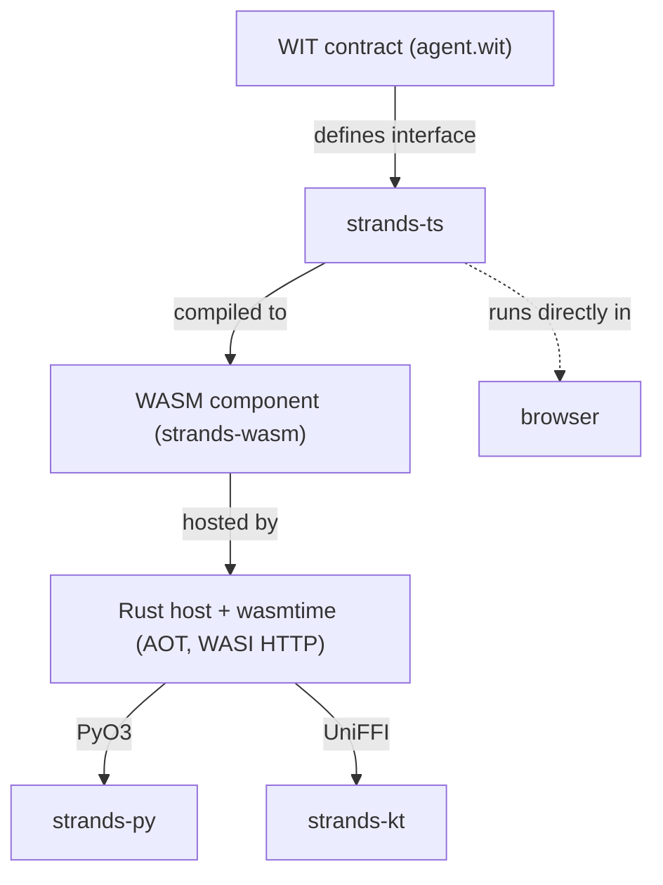

# Strands SDK: Polyglot architecture proposal

1. [Executive summary](#executive-summary)
1. [Implementation](#implementation)
1. [Results](#results)
1. [Summary](#summary)
1. [Q&A](#qa)
1. [Glossary](#glossary)
1. [Appendix A: Line counts](#appendix-a-line-counts)
1. [Appendix B: Line count projections](#appendix-b-line-count-projections)
1. [Appendix C: Discrepancy analysis](#appendix-c-discrepancy-analysis)
1. [Appendix D: Reimplementation analysis](#appendix-d-reimplementation-analysis)
1. [Appendix E: On-disk size analysis](#appendix-e-on-disk-size-analysis)
1. [Appendix F: Performance analysis](#appendix-f-performance-analysis)
1. [Appendix G: Test status](#appendix-g-test-status)
1. [Appendix H: Delivery estimate](#appendix-h-delivery-estimate)

## Executive summary

Today the Strands team maintains two SDKs: Python and TypeScript. Each is an independent implementation of the entire agent runtime, written from scratch. The Python SDK is ~65,670 LOC across source, unit tests, and integration tests. [[A]](#appendix-a-line-counts) A TypeScript SDK at parity, with equivalent tests, would be roughly the same. Together that is ~131,340 LOC for two languages that do the same thing.

Every feature must be implemented, tested, and fixed independently in both. When a model provider changes its API, the team splits to update both codebases. When a bug is found in the event loop, it gets patched twice, and each patch can introduce its own new bugs. The SDKs already drift. 42% of the Python SDK has no TypeScript equivalent today. [[C]](#appendix-c-discrepancy-analysis)

This document proposes replacing independent per-language implementations with a shared architecture built on the TypeScript SDK and WebAssembly. It includes a working demo that passes 54 of 106 upstream Python integration tests, benchmarks against the native SDK, and a line-by-line accounting of the costs and savings.

## Implementation

WebAssembly (WASM) is a compilation target. Code written in one language is compiled to a portable binary that runs in a sandboxed runtime on any platform. The WASM Component Model adds a type system at the boundary, so the host and guest can exchange structured data through a shared interface definition as opposed to raw bytes.

The agent runtime is implemented once in TypeScript, compiled to WASM, and hosted from any language through a thin, native wrapper. A typed interface contract defines the boundary. Each language wrapper handles only what must be language-native, like the API surface, type conversions, and tools. Everything else lives in the shared TypeScript implementation.



| Package             | Language   | Role                                                                 |
| ------------------- | ---------- | -------------------------------------------------------------------- |
| **wit/**            | WIT        | Agent interface contract and single source of truth                  |
| **strands-ts/**     | TypeScript | Core SDK: agent loop, model providers, tools, hooks, conversations   |
| **strands-wasm/**   | TS to WASM | Bridges TS SDK to WIT exports, compiles to a WASM component          |
| **strands-rs/**     | Rust       | WASM host: Wasmtime, AOT compilation, streaming, PyO3/UniFFI for FFI |
| **strands-py/**     | Python     | Python wrapper: Agent class, @tool decorator, structured output      |
| **strands-derive/** | Rust       | Proc macro: generates PyO3/UniFFI types from WIT bindgen output      |

The TypeScript SDK already exists and is actively maintained. This architecture replaces ~65,670 lines of independent Python implementation with ~4,700 lines of glue and sanity tests on top of that same TypeScript SDK. [[A]](#appendix-a-line-counts) One agent runtime, one set of model providers, one set of bugs. For the two languages we support today, that cuts the total codebase nearly in half.

New features added to the TypeScript SDK are available to every language in the next build. Additional languages beyond Python and TypeScript are a bonus, not the premise.

### The WIT contract (wit/agent.wit)

WIT (WASM Interface Type) is an interface definition language for WASM components, similar to protobuf or OpenAPI. Toolchains generate language-specific bindings from the same definition. A single 201-line WIT file produces Rust structs via `wasmtime::component::bindgen!`, TypeScript types via `componentize-js`, and Python dataclasses via `componentize-py`.

The WIT contract is the API boundary between the host and the guest. Everything that enters or leaves the WASM sandbox is defined here.

The contract exports two resources that the host calls into:

- `agent` - constructed with a config (model, system prompt, tools). Exposes `generate()` which returns a response stream, plus `get-messages()` and `set-messages()` for conversation persistence.
- `response-stream` - returned by `generate()`. The host calls `read-next()` in a loop to pull batches of stream events (text-delta, tool-use, tool-result, metadata, stop, error, interrupt, lifecycle). Also supports `respond()` for interrupt payloads and `cancel()`.

The contract imports two interfaces that the guest calls into:

- `tool-provider` - the guest calls `call-tool(name, input_json, tool_use_id)` when the model requests a tool invocation. The host executes the tool in the language runtime and returns the result as JSON.
- `host-log` - structured logging from guest to host. The guest emits log entries at key decision points; the host routes them to its own logging backend (Python `logging`, Rust `tracing`).

All types are defined in the `types` interface, including stream event variants, model configs, tool specs, and lifecycle events. Changes to the WIT contract break builds in Rust, TypeScript, and Python simultaneously, which prevents the API from drifting between language implementations.

### The TypeScript SDK (strands-ts/)

The TypeScript SDK is the existing Strands SDK for TypeScript. It already ships as its own npm package, has 17,247 lines of unit tests [[A]](#appendix-a-line-counts), and is used directly by TypeScript developers. It is the production TypeScript SDK that also serves as the shared implementation inside the WASM component.

This is the key design choice. Rather than writing a purpose-built WASM runtime, we compile the real SDK. The TypeScript SDK already runs natively in the browser, in Node, and now inside WASM. It works in every environment we intend to support without requiring a translation layer. Every bug fix and feature that lands in the TypeScript SDK for its own users automatically benefits Python, Swift, and every other language wrapper. The team maintains one SDK, and the polyglot architecture rides on top.

The TypeScript SDK was built after the Python SDK and is 13,009 lines of source today. [[A]](#appendix-a-line-counts) It does not yet have full parity with the Python SDK's 20,966 lines, but closing that gap is already planned work for TypeScript v1.0.

### The WASM bridge (strands-wasm/)

The bridge adapts the TypeScript SDK to the WIT contract. It is a single file, `entry.ts` (496 lines), that implements the WIT-exported `agent` and `response-stream` resources by delegating to the TS SDK.

When the host calls `agent.generate()`, the bridge translates WIT config into SDK objects, starts the SDK's agent, and wraps its async event stream in a `response-stream` resource. When the host calls `read-next()`, the bridge pulls the next event from the SDK, maps it to a WIT stream-event variant, and returns it. When the SDK needs to call a tool, the bridge routes the call back through the WIT `call-tool` import to the host.

A 70-line build script bundles the bridge with the full TS SDK into a single ESM file via esbuild, then compiles it into a WASM component targeting the `agent` WIT world.

### The Rust host (strands-rs/)

The WASM component runs in a sandbox and cannot make HTTP calls on its own. It needs a host process that provides WASI HTTP so the TypeScript SDK inside can reach model provider APIs. In principle, any language could be the host. In practice, the wasmtime C API does not expose WASI HTTP, which rules out hosting from Python, Kotlin, or other languages via C bindings. Only the Rust crate `wasmtime-wasi-http` provides this. The component also bundles a JavaScript runtime that would take seconds to JIT-compile on every startup without AOT compilation, which is also only available from the Rust API.

The Rust host addresses both. The `wasmtime-wasi-http` crate provides the HTTP networking the sandbox needs, and the Rust build system AOT-compiles the WASM component at `cargo build` time, producing native machine code that the runtime loads in milliseconds. The host is both a standalone Rust SDK and the foundation for language bindings via PyO3 for Python and UniFFI for Swift and Kotlin.

The host caches the compiled engine, component, and linker process-wide. The first agent construction pays ~100ms; every subsequent construction pays ~7ms. It handles WASI plumbing (stdio, HTTP), resolves and injects AWS credentials because the sandbox can't access the filesystem, and exposes streaming at two levels: a high-level async `Stream` for Rust consumers and low-level `start_stream()` / `next_events()` / `close_stream()` for FFI consumers. The `strands-derive` proc macro generates PyO3 and UniFFI wrapper types from the WIT bindgen output, so new WIT types automatically become available in Python and Swift.

### The Python wrapper (strands-py/)

The Python wrapper makes the Rust host feel like a native Python SDK:

```python
from strands import Agent
from strands.tools.decorator import tool

@tool
def add(a: int, b: int) -> int:
    """Add two numbers."""
    return a + b

agent = Agent(tools=[add])
result = agent("What is 2 + 3?")
```

This is the same API as the upstream Strands Python SDK. A user switching from the upstream SDK to the polyglot SDK changes nothing.

Under the hood, `Agent.__init__` constructs the Rust agent via PyO3 with model config and tool specs. `Agent.__call__` starts a WASM stream and pulls events in a loop. Text deltas are accumulated, tool-use events dispatch to the Python tool handler, lifecycle events fire Python hook callbacks. The `@tool` decorator inspects type hints and docstrings to generate JSON schemas, then wraps the function in a handler that bridges JSON across the FFI boundary.

The wrapper is 3,078 lines of hand-written Python, 4,700 including sanity integration tests, with zero runtime dependencies because everything is bundled in the native binary. [[A]](#appendix-a-line-counts) It reuses the upstream Python SDK's integration test suite unmodified. 54 of 106 tests pass today. [[G]](#appendix-g-test-status)

### Adding a new language

A Swift wrapper would follow the same pattern as the Python wrapper. An idiomatic `Agent` class, type conversions between WIT types and Swift types, a tool builder using Swift idioms, and model config wrappers. The entire agent runtime already exists in the TypeScript SDK inside the WASM component and would not be reimplemented.

Based on the Python wrapper's breakdown, a new language wrapper is roughly 1,400 lines of glue: API surface, type conversions, tool builder, and config wrappers. The Rust host's UniFFI feature generates the FFI bindings automatically. The WIT contract guarantees type compatibility at compile time.

> Note: After writing this doc, I implemented Strands in Kotlin, providing support for both Java and Kotlin at the same time. This projection was accurate.

## Results

- **~61,000 fewer lines of code** for two languages at parity, a 46% reduction. Each additional language saves the cost of reimplementing the entire runtime. [[A]](#appendix-a-line-counts) [[B]](#appendix-b-line-count-projections)
- **10x faster import, 15x faster agent construction** vs the native Python SDK. Agent invocations perform within noise. [[F]](#appendix-f-performance-analysis)
- **One bug fix ships to every language.** Issues outside the API surface are resolved in TypeScript exclusively.
- **API drift breaks the build.** WIT contract changes break all language builds simultaneously.
- **No feature is blocked by the boundary.** Model providers, MCP, hooks, structured output, and streaming already cross it. [[G]](#appendix-g-test-status)
- **54 of 106 upstream integration tests pass** with zero test code in the polyglot wrapper. [[G]](#appendix-g-test-status)

### Caveats

- **35% larger on disk** (96 MB vs 71 MB), but bundled as 1 package with zero runtime dependencies vs 49 packages. [[E]](#appendix-e-on-disk-size-analysis)
- **42% of the Python SDK source has no TypeScript equivalent**, including 7 model providers, experimental features like bidi and steering, and OTel telemetry. Some of this is needed for parity; some may not be. [[C]](#appendix-c-discrepancy-analysis)

## Summary

This architecture cuts the combined SDK codebase nearly in half for Python and TypeScript today. It unifies the team around a single agent runtime instead of splitting effort across independent implementations. It also opens the door for any team at Amazon to use Strands regardless of language, at a fraction of the cost of writing each SDK from scratch. The tradeoffs are a larger binary, a more involved build, and a sprint to close the feature gap between the TypeScript and Python SDKs.

## Q&A

**Does this mean we stop maintaining the Python SDK?**

No. The polyglot Python wrapper replaces the internals, not the API. Users see the same `Agent` class, the same `@tool` decorator, the same imports. The wrapper passes 54 of 106 upstream integration tests unmodified today. The goal is full compatibility.

**Will development be harder?**

Yes. Today our team spends more time on maintainance than development. This architecture aims to flip that. The build pipeline has more layers, the WASM boundary adds indirection when debugging, and the toolchain is new to the team. These are real costs. The return is that every feature ships to every language once, every bug is fixed once, and the WIT contract catches drift at compile time instead of in production.

Today the team maintains two independent runtimes. At three languages, that is three. This architecture implies one implementation regardless of how many languages we support. The complexity moves from multiplying work across codebases to learning a deeper, more singular stack.

**What happens when the upstream Python SDK ships a feature we don't have?**

If the feature is already in the TypeScript SDK, it may work through WASM immediately or require some bridge wiring depending on whether the WIT contract already covers the relevant types. If the feature is not in the TypeScript SDK, it either gets implemented there where it benefits all languages, or implemented natively in the wrapper for the specific language that needs it.

**Why Rust? Who on the team knows Rust?**

Rust is required because the wasmtime C API does not expose WASI HTTP, and because JIT compilation of WASM artifacts is too slow. The Rust layer is ~1,500 lines and changes infrequently. Sometimes features need routing through the Rust host, those features will be implemented in every language we support, but most development will happen in TypeScript.

**How long will this take?**

> This is a ballpark estimate, not a commitment. The team has to agree on an approach before we can commit to timelines.

Roughly 14-18 person-weeks to reach full feature parity, pass all upstream integration tests, and release Python + TypeScript 2.0. With 3-4 engineers that is 6-8 calendar weeks. Beyond 4 engineers the gains are marginal because the remaining work has dependencies between layers. [[H]](#appendix-h-delivery-estimate)

**Can model providers be defined in the host language?**

Not today. All model providers currently run inside the WASM component via the TypeScript SDK. A host-side model provider interface is architecturally possible by adding a WIT import that the guest calls when it needs to invoke a model, similar to how `tool-provider` works for tools. This is a decision point for the team: host-side providers would let users write custom providers in Python or Kotlin, but they add a new cross-boundary protocol and the performance characteristics change. The current approach keeps model logic in one place.

**What about async?**

The Python wrapper supports async natively. `invoke_async`, `stream_async`, and structured output all return Python awaitables backed by Rust futures via PyO3. The limitation is one concurrent stream per agent instance. The Rust host holds a mutex on the WASM store, so a single agent cannot run multiple invocations in parallel. Multiple agent instances can run concurrently on separate threads. This matches the upstream Python SDK's concurrency model.

**How do you debug across the WASM boundary?**

Logging crosses the boundary through the `host-log` WIT import. The guest emits structured log entries that the host routes to the language's logging framework. For deeper debugging, `use_jit` mode loads the uncompiled WASM at runtime, which is slower but allows inspecting the full stack. Most bugs are either in the TypeScript SDK, where they can be debugged with normal TS tooling before compilation, or in the language wrapper, where they can be debugged natively. More work needs to be done here, but it is also possible to canonicalize stack traces across sandbox boundaries. Crashes in the Rust host are fatal.

## Glossary

| Term                 | Definition                                                                                                                                                                                   |
| -------------------- | -------------------------------------------------------------------------------------------------------------------------------------------------------------------------------------------- |
| WASM                 | WebAssembly. A compilation target that produces portable binaries. Code compiled to WASM runs in a sandboxed runtime, isolated from the host system.                                         |
| WASM Component Model | An extension to WASM that adds typed interfaces at the module boundary. The host and guest agree on function signatures and data structures at compile time through an interface definition. |
| WIT                  | WASM Interface Type. The interface definition language for the Component Model. Comparable to protobuf or IDL. Toolchains generate language-specific bindings from a single .wit file.       |
| Host                 | The program that loads and runs a WASM component. In this architecture, the Rust host (strands-rs) running on wasmtime.                                                                      |
| Guest                | The code running inside the WASM sandbox. In this architecture, the TypeScript SDK compiled to a WASM component.                                                                             |
| WASI                 | WebAssembly System Interface. A set of standardized APIs that give WASM modules access to system capabilities (filesystem, HTTP, clocks) through the host.                                   |
| wasmtime             | A WASM runtime by the Bytecode Alliance. Supports interpretation, JIT compilation, and AOT compilation of WASM components.                                                                   |
| AOT                  | Ahead-of-time compilation. The WASM component is compiled to native machine code at build time rather than at runtime, avoiding JIT overhead on startup.                                     |
| PyO3                 | A Rust library for writing Python extensions. Used here to expose the Rust host as a Python module.                                                                                          |
| UniFFI               | A Mozilla tool for generating language bindings (Swift, Kotlin, Ruby) from a Rust library. Used here to enable future language support beyond Python.                                        |

## Appendix A: Line counts

The upstream Python SDK is 65,670 LOC (source + unit tests + integ tests). The TypeScript SDK is 24,152 LOC. The polyglot stack that bridges them is 4,385 LOC.

> Measured 2026-02-26 with [scc](https://github.com/boyter/scc) v3.6.0. `brew install scc` if needed.

### Upstream Python SDK

```bash
cd {sdk-python}
scc src/strands/ --no-cocomo
scc tests/ --no-cocomo | grep Python
scc tests_integ/ --no-cocomo | grep Python
```

| Directory    | Files   | Lines      | Blanks | Comments | Code       |
| ------------ | ------- | ---------- | ------ | -------- | ---------- |
| src/strands/ | 141     | 31,879     | 3,388  | 7,525    | 20,966     |
| tests/       | 140     | 49,347     | 8,597  | 3,577    | 37,173     |
| tests_integ/ | 83      | 10,537     | 1,943  | 1,063    | 7,531      |
| **Total**    | **364** | **91,763** | 13,928 | 12,165   | **65,670** |

#### Per source module - `scc src/strands/<dir>/ --no-cocomo | grep Python`:

| Module        | Files   | Lines      | Blanks | Comments | Code       |
| ------------- | ------- | ---------- | ------ | -------- | ---------- |
| agent/        | 11      | 2,191      | 161    | 433      | 1,597      |
| event_loop/   | 5       | 1,240      | 159    | 353      | 728        |
| models/       | 14      | 6,999      | 620    | 1,319    | 5,060      |
| tools/        | 24      | 5,611      | 652    | 1,524    | 3,435      |
| hooks/        | 3       | 796        | 66     | 199      | 531        |
| multiagent/   | 8       | 3,416      | 359    | 708      | 2,349      |
| session/      | 6       | 1,248      | 160    | 295      | 793        |
| types/        | 18      | 2,608      | 419    | 984      | 1,205      |
| telemetry/    | 5       | 1,733      | 91     | 275      | 1,367      |
| handlers/     | 2       | 83         | 17     | 34       | 32         |
| experimental/ | 40      | 5,729      | 642    | 1,327    | 3,760      |
| (top-level)   | 5       | 225        | 42     | 74       | 109        |
| **Total**     | **141** | **31,879** | 3,388  | 7,525    | **20,966** |

### TypeScript SDK

```bash
cd strands-ts
scc src/ --no-cocomo --exclude-dir __tests__,__fixtures__ | grep TypeScript  # source only
scc src/ --no-cocomo | grep TypeScript                                       # source + unit tests
scc test/ --no-cocomo | grep TypeScript                                      # integration tests
scc examples/ --no-cocomo | grep TypeScript
```

| Directory          | Files   | Lines      | Blanks | Comments | Code       |
| ------------------ | ------- | ---------- | ------ | -------- | ---------- |
| src/ (source only) | 67      | 13,009     | 1,432  | 4,793    | 6,784      |
| src/ (all)         | 114     | 31,209     | 3,998  | 5,477    | 21,734     |
| test/              | 22      | 3,028      | 430    | 301      | 2,297      |
| examples/          | 2       | 172        | 26     | 25       | 121        |
| **Total**          | **138** | **34,409** | 4,454  | 5,803    | **24,152** |

#### Per source module - `scc src/<dir>/ --no-cocomo --exclude-dir __tests__ | grep TypeScript`:

| Module                | Files  | Lines      | Blanks | Comments | Code      |
| --------------------- | ------ | ---------- | ------ | -------- | --------- |
| agent/                | 4      | 1,392      | 154    | 555      | 683       |
| models/               | 9      | 4,199      | 465    | 1,316    | 2,418     |
| tools/                | 5      | 861        | 79     | 468      | 314       |
| hooks/                | 4      | 678        | 64     | 298      | 316       |
| multiagent/           | 5      | 242        | 21     | 94       | 127       |
| session/              | 6      | 536        | 46     | 220      | 270       |
| types/                | 6      | 1,854      | 180    | 794      | 880       |
| structured-output/    | 4      | 375        | 48     | 135      | 192       |
| conversation-manager/ | 3      | 298        | 36     | 130      | 132       |
| vended-tools/         | 12     | 1,430      | 198    | 424      | 808       |
| logging/              | 3      | 82         | 9      | 54       | 19        |
| registry/             | 2      | 571        | 79     | 132      | 360       |
| (top-level + utils)   | 4      | 491        | 53     | 173      | 265       |
| **Total**             | **67** | **13,009** | 1,432  | 4,793    | **6,784** |

### Polyglot stack

```bash
scc strands-wasm/entry.ts strands-wasm/build.js --no-cocomo
scc strands-rs/src/ strands-derive/src/ --no-cocomo | grep Rust
wc -l wit/agent.wit
scc strands-py/strands/ --no-cocomo --exclude-dir generated | grep Python
scc strands-py/strands/generated/ --no-cocomo | grep Python
```

| Component                     | Language   | Files  | Lines     | Blanks | Comments | Code      |
| ----------------------------- | ---------- | ------ | --------- | ------ | -------- | --------- |
| WASM bridge (entry.ts)        | TypeScript | 1      | 496       | 64     | 18       | 414       |
| WASM bridge (build.js)        | JavaScript | 1      | 70        | 7      | 28       | 35        |
| Rust host                     | Rust       | 4      | 1,457     | 138    | 132      | 1,187     |
| WIT contract                  | wit        | 1      | 201       | -      | -        | -         |
| Python wrapper (hand-written) | Python     | 32     | 3,177     | 473    | 248      | 2,456     |
| Python wrapper (generated)    | Python     | 9      | 404       | 99     | 12       | 293       |
| **Total**                     |            | **48** | **5,805** | 781    | 438      | **4,385** |

### Summary

| Codebase            | Source | Unit tests | Integ tests | Total  |
| ------------------- | ------ | ---------- | ----------- | ------ |
| Upstream Python SDK | 20,966 | 37,173     | 7,531       | 65,670 |
| TypeScript SDK      | 6,905  | 14,950     | 2,297       | 24,152 |
| Polyglot stack      | 4,385  | 0          | 0           | 4,385  |

## Appendix B: Line count projections

At TS parity, each new language costs ~1,600 lines of source. Without it, each language reimplements ~13,750 lines independently. The TS investment pays for itself before the second language.

> Best-guess estimates of source lines only (excluding tests). Grounded in measured line counts but the new-code numbers are informed guesses.

### Starting point

| Component                     | Lines      |
| ----------------------------- | ---------- |
| TS SDK (source)               | 13,009     |
| WASM bridge + Rust host + WIT | 2,224      |
| Python wrapper                | 3,078      |
| **Shared infra**              | **15,233** |
| **Per-language (Python)**     | **3,078**  |

The Python wrapper is 1,390 glue + 1,233 reimplemented + 455 native I/O.

13,316 lines (42%) of the upstream Python SDK have no TS equivalent. All of it is portable to TS given sufficient WIT host imports. There is no fundamental reason any feature can't cross the WASM boundary. The host provides I/O (stdio, HTTP, WebSocket, OTel SDK), the TS SDK handles the protocol.

### What moves to TS

Everything except language-idiomatic glue. The pattern is already proven: model providers run host-side but the logic is in TS. MCP, bidi, A2A, telemetry -same pattern.

| Category                             | TS lines added (once) | Per-lang lines eliminated | Notes                                                   |
| ------------------------------------ | --------------------- | ------------------------- | ------------------------------------------------------- |
| **Already reimplemented in wrapper** |                       |                           |                                                         |
| Graph/swarm/multiagent base          | ~560-700              | 714                       | TS multiagent is 242 lines today                        |
| Stream consumption + errors          | ~100-150              | ~100                      | Move into WASM bridge                                   |
| Structured output retry              | ~30-50                | ~50                       | TS already has structured-output/                       |
| Hook registry wiring                 | ~50                   | 109                       | TS already has hooks/ -fix bridge batching              |
| Sliding window + retry               | ~20                   | 69                        | TS already has both                                     |
| MCP tool lifecycle                   | ~50                   | 91                        | Wire start/stop through bridge                          |
| MCP client                           | ~400-600              | 455                       | Route through WASM with host I/O imports                |
| **Not yet in TS or wrapper**         |                       |                           |                                                         |
| 7 model providers                    | ~2,500-3,000          | -                         | New TS work, ~350-430 per provider                      |
| Tool executors                       | ~300-400              | -                         | Concurrent/sequential in TS                             |
| Summarizing conv mgr                 | ~200-300              | -                         | LLM call from TS side                                   |
| Bidi                                 | ~2,500-3,500          | -                         | TS handles protocol, host provides WebSocket/audio I/O  |
| A2A                                  | ~500-700              | -                         | TS handles A2A protocol, host provides HTTP server      |
| Telemetry                            | ~800-1,200            | -                         | TS emits trace events, host routes to language OTel SDK |
| Steering                             | ~500-700              | -                         | LLM handler logic in TS                                 |
| Experimental hooks + handlers        | ~200-350              | -                         | Event types                                             |
| **Total TS investment**              | **~8,700-11,700**     | **1,588**                 |                                                         |

After this, a language wrapper is only glue: API surface, type conversions, tool decorator/builder idiom, and thin host I/O adapters (WIT imports for stdio, HTTP, WebSocket, OTel).

### Projection 1: TS parity

Invest ~10,000 lines in the TS SDK, bridge, and WIT. The per-language wrapper is glue only.

| Component                | Today      | After              |
| ------------------------ | ---------- | ------------------ |
| TS SDK                   | 13,009     | ~23,000-25,000     |
| Bridge + Rust + WIT      | 2,224      | ~3,000-3,500       |
| **Shared infra**         | **15,233** | **~26,000-28,500** |
| **Per-language wrapper** | **3,078**  | **~1,400**         |

The per-language wrapper drops to ~1,400 lines -the irreducible glue: type conversions (~350), API surface (~500), tool builder (~200), model config wrappers (~200), types/errors/stubs (~150).

Host I/O adapters (WIT imports for stdio, HTTP, WebSocket, OTel) add ~200-400 lines per language but are mechanical -they bridge the language's I/O primitives to the WIT contract.

### Projection 2: Native backfill

Keep the TS SDK as-is. Implement all missing features directly in each language wrapper.

| Component                | Today      | After              |
| ------------------------ | ---------- | ------------------ |
| TS SDK                   | 13,009     | 13,009             |
| Bridge + Rust + WIT      | 2,224      | 2,224              |
| **Shared infra**         | **15,233** | **15,233**         |
| **Per-language wrapper** | **3,078**  | **~13,000-14,500** |

Every language independently reimplements model providers (~3,600), graph/swarm (~700), bidi (~3,200), MCP (~450), A2A (~675), telemetry (~1,350), executors (~450), steering (~650), and everything else. Same logic, independent bugs, N times.

### Side by side at N languages

| Languages                  | TS parity                   | Native backfill              |
| -------------------------- | --------------------------- | ---------------------------- |
| Shared infra               | ~27,000                     | 15,233                       |
| 1 (Python)                 | 27,000 + 1,600 = **28,600** | 15,233 + 13,750 = **28,983** |
| 2 (+Swift)                 | 27,000 + 3,200 = **30,200** | 15,233 + 27,500 = **42,733** |
| 3 (+Kotlin)                | 27,000 + 4,800 = **31,800** | 15,233 + 41,250 = **56,483** |
| 5 languages                | 27,000 + 8,000 = **35,000** | 15,233 + 68,750 = **83,983** |
| **Marginal cost per lang** | **~1,600**                  | **~13,750**                  |

Per-language wrapper estimate: ~1,400 glue + ~200 host I/O adapters = ~1,600.

At 1 language the strategies cost the same (~28,500-29,000) - but only if we don't end up implementing these features in TypeScript anyway. If the TS SDK gets model providers, bidi, or telemetry for its own users, the native backfill approach pays for those features twice. At 3 languages, TS parity saves ~25,000 lines. At 5, it saves ~49,000.

The TS investment is ~10,000 lines. Each language saves ~12,000 lines vs native backfill. The investment pays for itself before the second language is complete.

## Appendix C: Discrepancy analysis

13,316 lines (42%) of the Python SDK source has no TypeScript equivalent today. 18,563 lines (58%) does. Every line is accounted for below.

> Every number verified against scc output.

### Python-only code (no TS equivalent)

```bash
cd ~/Documents/strands/sdk-python/src/strands
scc models/llamacpp.py models/sagemaker.py models/litellm.py models/mistral.py models/writer.py models/llamaapi.py models/ollama.py --no-cocomo
scc experimental/ --no-cocomo
scc multiagent/a2a/ --no-cocomo
scc agent/a2a_agent.py --no-cocomo
scc tools/executors/ --no-cocomo
scc agent/conversation_manager/summarizing_conversation_manager.py --no-cocomo
scc telemetry/ --no-cocomo
scc handlers/ --no-cocomo
```

| Module                              | Files  | Lines      | Blanks | Comments | Code      |
| ----------------------------------- | ------ | ---------- | ------ | -------- | --------- |
| models/llamacpp.py                  | 1      | 767        | 33     | 95       | 639       |
| models/sagemaker.py                 | 1      | 628        | 79     | 171      | 378       |
| models/litellm.py                   | 1      | 564        | 41     | 97       | 426       |
| models/mistral.py                   | 1      | 554        | 87     | 138      | 329       |
| models/writer.py                    | 1      | 469        | 22     | 30       | 417       |
| models/llamaapi.py                  | 1      | 454        | 55     | 119      | 280       |
| models/ollama.py                    | 1      | 371        | 29     | 45       | 297       |
| experimental/                       | 40     | 5,729      | 642    | 1,327    | 3,760     |
| multiagent/a2a/                     | 4      | 815        | 64     | 164      | 587       |
| agent/a2a_agent.py                  | 1      | 262        | 14     | 35       | 213       |
| tools/executors/                    | 4      | 559        | 70     | 115      | 374       |
| summarizing_conversation_manager.py | 1      | 328        | 32     | 77       | 219       |
| telemetry/                          | 5      | 1,733      | 91     | 275      | 1,367     |
| handlers/                           | 2      | 83         | 17     | 34       | 32        |
| **Total Python-only**               | **64** | **13,316** | 1,276  | 2,722    | **9,318** |

**13,316 lines (41.8%) of the Python SDK has no TS equivalent.**

### Shared code (has a TS equivalent)

```bash
cd {sdk-python}/src/strands
scc models/bedrock.py models/anthropic.py models/openai.py models/gemini.py models/model.py models/_validation.py models/__init__.py --no-cocomo | grep Python
scc agent/agent.py agent/agent_result.py agent/base.py agent/state.py agent/__init__.py agent/conversation_manager/conversation_manager.py agent/conversation_manager/sliding_window_conversation_manager.py agent/conversation_manager/null_conversation_manager.py agent/conversation_manager/__init__.py --no-cocomo | grep Python
scc event_loop/ --no-cocomo | grep Python
scc tools/ --no-cocomo --exclude-dir executors | grep Python
scc hooks/ --no-cocomo | grep Python
scc multiagent/ --no-cocomo --exclude-dir a2a | grep Python
scc session/ --no-cocomo | grep Python
scc types/ --no-cocomo | grep Python
```

| Module                                  | Files  | Lines      | Blanks | Comments | Code       |
| --------------------------------------- | ------ | ---------- | ------ | -------- | ---------- |
| models/ (4 shared providers + base)     | 7      | 3,192      | 274    | 624      | 2,294      |
| agent/ (excl a2a_agent.py, summarizing) | 9      | 1,601      | 115    | 321      | 1,165      |
| event_loop/                             | 5      | 1,240      | 159    | 353      | 728        |
| tools/ (excl executors/)                | 20     | 5,052      | 582    | 1,409    | 3,061      |
| hooks/                                  | 3      | 796        | 66     | 199      | 531        |
| multiagent/ (excl a2a/)                 | 4      | 2,601      | 295    | 544      | 1,762      |
| session/                                | 6      | 1,248      | 160    | 295      | 793        |
| types/                                  | 18     | 2,608      | 419    | 984      | 1,205      |
| top-level files                         | 5      | 225        | 42     | 74       | 109        |
| **Total shared**                        | **77** | **18,563** | 2,112  | 4,803    | **11,648** |

**18,563 lines (58.2%) of the Python SDK has a TS equivalent.**

### TS-only code (no Python equivalent)

```bash
cd strands-ts/src
scc vended-tools/ --no-cocomo --exclude-dir __tests__ | grep TypeScript
scc tools/zod-tool.ts --no-cocomo | grep TypeScript
```

| Module                                                    | Files  | Lines     | Blanks | Comments | Code    |
| --------------------------------------------------------- | ------ | --------- | ------ | -------- | ------- |
| vended-tools/ (bash, file_editor, http_request, notebook) | 12     | 1,430     | 198    | 424      | 808     |
| tools/zod-tool.ts                                         | 1      | 235       | 21     | 125      | 89      |
| **Total TS-only**                                         | **13** | **1,665** | 219    | 549      | **897** |

## Appendix D: Reimplementation analysis

40% of the Python wrapper (1,233 of 3,078 lines) reimplements logic that could live in the TypeScript SDK. 45% is irreducible glue. 15% wraps Python-native I/O.

### Classification

Each file falls into one of three buckets:

- **Glue**: Per-language boilerplate that every wrapper must have. Type conversions, API surface, language idioms. Cannot move to TS.
- **Reimplemented**: Logic that duplicates what the upstream Python SDK does, reimplemented in the wrapper instead of being routed through the TS SDK via WASM. Could move to TS.
- **Native I/O**: Code that wraps a Python-native library (MCP SDK) or runtime feature (asyncio). Moving to TS would mean reimplementing the I/O layer, not just the logic.

### The numbers

| File                       | Lines | Bucket        | Why                                                                                                                      |
| -------------------------- | ----- | ------------- | ------------------------------------------------------------------------------------------------------------------------ |
| agent/\_\_init\_\_.py      | 694   | Mixed         | See breakdown below                                                                                                      |
| multiagent/graph.py        | 486   | Reimplemented | Full graph orchestration reimplemented in Python. TS has `multiagent/nodes.ts` (135 lines) but not the full graph engine |
| tools/mcp/mcp_client.py    | 455   | Native I/O    | Wraps Python `mcp` SDK directly over stdio/SSE. Can't route through WASM                                                 |
| \_conversions.py           | 386   | Glue          | WIT ↔ Python type mapping. Every language needs this                                                                     |
| tools/decorator.py         | 206   | Glue          | `@tool` decorator. Python-specific idiom                                                                                 |
| multiagent/base.py         | 126   | Reimplemented | Base class, NodeResult, Status enum. Could be shared types from TS                                                       |
| hooks.py                   | 109   | Reimplemented | HookRegistry, event classes, fire/fire_async. TS has this (hooks/registry.ts, 150 lines)                                 |
| multiagent/swarm.py        | 102   | Reimplemented | Swarm orchestration. TS has minimal multiagent (242 lines total)                                                         |
| models/bedrock.py          | 68    | Glue          | Config wrapper -passes env vars to TS via WASM                                                                           |
| conv_mgr/sliding_window.py | 48    | Reimplemented | Reimplements sliding window. TS has this (261 lines)                                                                     |
| models/openai.py           | 47    | Glue          | Config wrapper                                                                                                           |
| models/anthropic.py        | 45    | Glue          | Config wrapper                                                                                                           |
| models/gemini.py           | 37    | Glue          | Config wrapper                                                                                                           |
| types/tools.py             | 35    | Glue          | ToolContext dataclass                                                                                                    |
| \_\_init\_\_.py            | 33    | Glue          | Package exports                                                                                                          |
| interrupt.py               | 32    | Glue          | Interrupt class definition                                                                                               |
| types/exceptions.py        | 27    | Glue          | Exception types                                                                                                          |
| event_loop/\_retry.py      | 21    | Reimplemented | Retry logic. TS handles this inside the event loop                                                                       |
| Everything else            | 121   | Glue          | \_\_init\_\_.py files, mcp types, session stubs                                                                          |

#### agent/\_\_init\_\_.py breakdown (694 lines)

This file is the biggest and does multiple things:

| Section                                                          | Lines (approx) | Bucket                                                                                        |
| ---------------------------------------------------------------- | -------------- | --------------------------------------------------------------------------------------------- |
| Data classes (AgentState, ToolEntry, Metrics, AgentResult, etc.) | ~120           | Glue -Python-idiomatic API surface                                                            |
| \_ToolProxy, \_ToolRegistryProxy                                 | ~50            | Glue -`agent.tool.name()` Python idiom                                                        |
| \_\_init\_\_ (constructor, kwarg handling)                       | ~60            | Glue -Python kwargs, defaults                                                                 |
| \_register_tools (tool parsing, MCP expansion)                   | ~90            | Mixed -tool dispatch is glue, MCP lifecycle is native I/O                                     |
| \_scan_tools_directory (hot reload)                              | ~30            | Glue -Python importlib                                                                        |
| \_consume_stream_async (event loop)                              | ~100           | Reimplemented -processes stream events, maps errors, tracks metrics. TS does this in agent.ts |
| \_call_async, \_\_call\_\_, invoke, invoke_async                 | ~50            | Glue -Python async/sync bridge                                                                |
| \_call_with_structured_output_async                              | ~50            | Reimplemented -structured output retry loop. TS has this in structured-output/                |
| stream_async                                                     | ~30            | Glue -Python async generator                                                                  |
| cleanup, properties, helpers                                     | ~60            | Glue -Python resource management                                                              |
| **Total**                                                        | **~694**       | ~250 reimplemented, ~444 glue                                                                 |

### Summary

| Bucket                             | Lines     | % of wrapper |
| ---------------------------------- | --------- | ------------ |
| **Glue** (must be per-language)    | 1,390     | 45%          |
| **Reimplemented** (could be in TS) | 1,233     | 40%          |
| **Native I/O** (Python MCP SDK)    | 455       | 15%          |
| **Total**                          | **3,078** | 100%         |

### What "reimplemented" means concretely

The 1,233 reimplemented lines break down as:

| Component                                          | Lines | What it reimplements                                           | TS equivalent                                              |
| -------------------------------------------------- | ----- | -------------------------------------------------------------- | ---------------------------------------------------------- |
| multiagent/graph.py                                | 486   | Graph orchestration (nodes, edges, execution, error handling)  | multiagent/nodes.ts (135 lines) -incomplete                |
| agent/\_\_init\_\_.py (stream + structured output) | 250   | Event loop consumption, error mapping, structured output retry | agent/agent.ts + structured-output/                        |
| multiagent/base.py                                 | 126   | Base class, result types, status enum                          | multiagent/types.ts (4 lines) -stub                        |
| hooks.py                                           | 109   | Hook registry, event dispatch, callback ordering               | hooks/registry.ts (150 lines) -exists                      |
| multiagent/swarm.py                                | 102   | Swarm orchestration (manager agent, handoffs)                  | multiagent/ -not implemented                               |
| conv_mgr/sliding_window.py                         | 48    | Sliding window truncation                                      | conversation-manager/sliding-window.ts (261 lines) -exists |
| event_loop/\_retry.py                              | 21    | Retry with backoff                                             | Built into TS agent event loop                             |
| Other (in agent/\_\_init\_\_.py)                   | 91    | MCP tool lifecycle in \_register_tools                         | -                                                          |

If all of this lived in the TS SDK instead, the per-language wrapper cost drops from ~3,100 to ~1,900 lines. The main blockers:

1. **TS multiagent is minimal** (242 lines vs Python's 2,601). Graph/swarm would need to be built out in TS before the wrapper could delegate to it.
2. **Hooks already exist in TS** but the wrapper reimplements them because lifecycle events from WASM are batched at `readNext()` boundaries -the bridge doesn't expose them granularly enough.
3. **Structured output exists in TS** but the retry loop is reimplemented because the Python wrapper consumes the WASM stream event-by-event and needs to decide when to retry.

## Appendix E: On-disk size analysis

The polyglot SDK installs at 96 MB in 1 package. The upstream SDK installs at 71 MB across 49 packages. The polyglot SDK has zero runtime dependencies.

> Measured on Apple M1 Pro by `pip install` into a clean venv, then `du` on site-packages (excluding pip).

### Total installed size

|                         | Upstream Python SDK           | Polyglot Python SDK |
| ----------------------- | ----------------------------- | ------------------- |
| **Size on disk**        | **71 MB**                     | **96 MB**           |
| Packages installed      | 49                            | 1                   |
| Wheel size (compressed) | ~50 KB + dependency downloads | 36 MB               |

```bash
# Upstream
python3 -m venv /tmp/upstream && /tmp/upstream/bin/pip install strands-agents
# Polyglot
python3 -m venv /tmp/polyglot && /tmp/polyglot/bin/pip install strands-0.0.1-*.whl
```

### What's in the 71 MB (upstream)

| Package                                     | Size   | What it is                                  |
| ------------------------------------------- | ------ | ------------------------------------------- |
| botocore                                    | 25 MB  | AWS API definitions                         |
| cryptography                                | 22 MB  | TLS/crypto (native binary)                  |
| pydantic + pydantic_core                    | 8.6 MB | Type validation (native binary)             |
| opentelemetry (api + sdk + instrumentation) | 3.7 MB | Tracing/metrics                             |
| mcp                                         | 2.2 MB | Model Context Protocol client               |
| boto3                                       | 1.4 MB | AWS SDK                                     |
| anyio                                       | 1.4 MB | Async I/O                                   |
| Everything else (~38 packages)              | 6.7 MB | jsonschema, httpx, starlette, uvicorn, etc. |

### What's in the 96 MB (polyglot)

| Package                         | Size   | What it is                                                                                              |
| ------------------------------- | ------ | ------------------------------------------------------------------------------------------------------- |
| \_strands.cpython-314-darwin.so | 96 MB  | Single native binary: wasmtime runtime + AOT-compiled WASM component (TS SDK, AWS SDK, model providers) |
| Python wrapper (.py files)      | 115 KB | Glue code                                                                                               |

The entire polyglot SDK is one file. The 96 MB includes everything the upstream SDK spreads across 49 packages: AWS SDK, model providers, MCP, type validation, and the agent runtime itself.

### Projection: as TS featureset grows

The WASM binary grows as features are added to the TS SDK. Rough estimate based on current ratios (~1 MB per 2,500 lines of TS source):

| TS SDK state                         | TS source lines | Installed size (est.) |
| ------------------------------------ | --------------- | --------------------- |
| Today                                | 6,784           | 96 MB                 |
| +7 model providers (~3,000 lines)    | ~9,800          | ~97 MB                |
| +bidi, A2A, telemetry (~5,000 lines) | ~14,800         | ~99 MB                |
| Full TS parity (~10,000 lines)       | ~16,800         | ~100 MB               |

The binary grows slowly with additional TS features because most of the 96 MB is the wasmtime runtime and the AWS SDK, not the agent logic. Adding 10,000 lines of TS source adds ~4 MB.

## Appendix F: Performance analysis

Agent invocations perform within noise of the native Python SDK. Import is 10x faster (113ms vs 1,101ms). Agent construction is 15x faster after first init (7ms vs 103ms).

> Measured 2026-02-26. Real Bedrock calls (us-east-1, Claude Sonnet). 20 runs each, first run is warmup. Times in ms.

### Results

| Metric        | Upstream (min/med/p95) | Polyglot (min/med/p95) |
| ------------- | ---------------------- | ---------------------- |
| Import        | 729 / 1,101 / 1,257    | 106 / 113 / 121        |
| Construction  | 94 / 103 / 293         | 6 / 7 / 218            |
| Simple invoke | 887 / 1,944 / 18,165   | 897 / 1,713 / 3,438    |
| Tool invoke   | 2,037 / 3,726 / 21,322 | 1,554 / 3,474 / 5,519  |

#### Import

Polyglot imports 10x faster (113ms vs 1,101ms). The upstream SDK pulls in OTel, all model providers, and heavy dependencies at import time. The polyglot wrapper defers to the WASM runtime.

#### Construction

After the one-time Engine/Component cache init (~218ms first call), polyglot construction is **7ms** vs upstream's **103ms**. The WASM module is pre-compiled and cached per process.

#### Simple invocation (no tools)

"Say hello in exactly 3 words." - median 1,713ms polyglot vs 1,944ms upstream. Within noise. Network dominates. Both have high variance from Bedrock latency (p95 spread is wide).

#### Tool invocation

"What is 2 + 3? Use the add tool." - median 3,474ms polyglot vs 3,726ms upstream. Again within noise. The WASM boundary crossing for tool dispatch (~5-15ms per call) is invisible against model latency.

### Raw data

#### Upstream

```
import:       min=729   med=1,101  p95=1,257   max=1,257   (n=5)
construction: min=94    med=103    p95=293     max=293     (n=20)
simple:       min=887   med=1,944  p95=18,165  max=18,165  (n=20)
tool:         min=2,037 med=3,726  p95=21,322  max=21,322  (n=20)
```

#### Polyglot

```
import:       min=106  med=113    p95=121    max=121    (n=5)
construction: min=6    med=7      p95=218    max=218    (n=20)
simple:       min=897  med=1,713  p95=3,438  max=3,438  (n=20)
tool:         min=1,554 med=3,474 p95=5,519  max=5,519  (n=20)
```

### Benchmark script

Run each SDK separately (different venvs), 20 iterations each:

```bash
# Upstream
~/Documents/strands/sdk-python/.venv/bin/python -c "$(cat <<'BENCH'
import json, statistics, subprocess, sys, time, io

N = 20

def fmt(times):
    s = sorted(times)
    n = len(s)
    med = statistics.median(s)
    p95 = s[int(n * 0.95)] if n >= 20 else s[-1]
    return f"min={s[0]:.0f}  med={med:.0f}  p95={p95:.0f}  max={s[-1]:.0f}"

def bench_import():
    times = []
    for _ in range(5):
        start = time.perf_counter()
        subprocess.run([sys.executable, "-c", "from strands import Agent"], capture_output=True)
        times.append((time.perf_counter() - start) * 1000)
    return times

from strands import Agent
from strands.models.bedrock import BedrockModel
from strands.tools.decorator import tool

@tool
def add(a: int, b: int) -> int:
    """Add two numbers."""
    return a + b

results = {}

# Import
results["import_ms"] = bench_import()
print(f"import: {fmt(results['import_ms'])} ms", file=sys.stderr)

# Construction
times = []
for _ in range(N):
    t0 = time.perf_counter()
    agent = Agent(model=BedrockModel())
    times.append((time.perf_counter() - t0) * 1000)
    del agent
results["construction_ms"] = times
print(f"construction: {fmt(times)} ms", file=sys.stderr)

# Simple invoke
old_stdout = sys.stdout
sys.stdout = io.StringIO()
times = []
for i in range(N):
    agent = Agent(model=BedrockModel())
    if i == 0:
        try: agent("warmup")
        except: pass
    t0 = time.perf_counter()
    r = agent("Say hello in exactly 3 words.")
    times.append((time.perf_counter() - t0) * 1000)
sys.stdout = old_stdout
results["simple_ms"] = times
print(f"simple: {fmt(times)} ms", file=sys.stderr)

# Tool invoke
sys.stdout = io.StringIO()
times = []
for i in range(N):
    agent = Agent(model=BedrockModel(), tools=[add])
    if i == 0:
        try: agent("warmup")
        except: pass
    t0 = time.perf_counter()
    r = agent("What is 2 + 3? Use the add tool.")
    times.append((time.perf_counter() - t0) * 1000)
sys.stdout = old_stdout
results["tool_ms"] = times
print(f"tool: {fmt(times)} ms", file=sys.stderr)

print(json.dumps(results, indent=2))
BENCH
)"

# Polyglot
strands-py/.venv/bin/python -c "$(cat <<'BENCH'
import json, statistics, subprocess, sys, time

N = 20

def fmt(times):
    s = sorted(times)
    n = len(s)
    med = statistics.median(s)
    p95 = s[int(n * 0.95)] if n >= 20 else s[-1]
    return f"min={s[0]:.0f}  med={med:.0f}  p95={p95:.0f}  max={s[-1]:.0f}"

def bench_import():
    times = []
    for _ in range(5):
        start = time.perf_counter()
        subprocess.run([sys.executable, "-c", "from strands import Agent"], capture_output=True)
        times.append((time.perf_counter() - start) * 1000)
    return times

from strands import Agent
from strands.models.bedrock import BedrockModel
from strands.tools.decorator import tool

@tool
def add(a: int, b: int) -> int:
    """Add two numbers."""
    return a + b

def suppress(agent):
    agent._printer = False
    return agent

results = {}

# Import
results["import_ms"] = bench_import()
print(f"import: {fmt(results['import_ms'])} ms", file=sys.stderr)

# Construction
times = []
for _ in range(N):
    t0 = time.perf_counter()
    agent = Agent(model=BedrockModel())
    times.append((time.perf_counter() - t0) * 1000)
    del agent
results["construction_ms"] = times
print(f"construction: {fmt(times)} ms", file=sys.stderr)

# Simple invoke
times = []
for i in range(N):
    agent = suppress(Agent(model=BedrockModel()))
    if i == 0:
        try: agent("warmup")
        except: pass
    t0 = time.perf_counter()
    r = agent("Say hello in exactly 3 words.")
    times.append((time.perf_counter() - t0) * 1000)
results["simple_ms"] = times
print(f"simple: {fmt(times)} ms", file=sys.stderr)

# Tool invoke
times = []
for i in range(N):
    agent = suppress(Agent(model=BedrockModel(), tools=[add]))
    if i == 0:
        try: agent("warmup")
        except: pass
    t0 = time.perf_counter()
    r = agent("What is 2 + 3? Use the add tool.")
    times.append((time.perf_counter() - t0) * 1000)
results["tool_ms"] = times
print(f"tool: {fmt(times)} ms", file=sys.stderr)

print(json.dumps(results, indent=2))
BENCH
)"
```

## Appendix G: Test status

Of the 106 collectable tests today: **54 pass, 51 fail, 1 xfail.**

### Failure categories (of collectable tests)

| Category                          | Count | Root cause                                                                               |
| --------------------------------- | ----- | ---------------------------------------------------------------------------------------- |
| Guardrails                        | 13    | TS SDK has no guardrail config — only maps stop reason                                   |
| Interrupts not wired through WASM | 13    | Types exist but `BeforeToolCallEvent.interrupt()` doesn't actually pause the WASM stream |
| MCP client remaining              | 7     | Message format (1), error lifecycle (2), task-augmented execution (4)                    |
| Bedrock model features            | 6     | `model.stream()` (2), citations (2), reasoning/redacted content blocks (2)               |
| Session manager stubs             | 5     | `FileSessionManager` and `S3SessionManager` are no-op stubs                              |
| S3 locations                      | 3     | Content format mismatch (`source.location` vs `source.s3Location`)                       |
| Cache points                      | 2     | `callback_handler` not wired to stream events                                            |
| Context overflow                  | 1     | Model context window large enough to handle test payload                                 |
| Lifecycle event ordering          | 1     | Bridge batches events at `readNext()` boundaries                                         |
| Agent loop behavior               | 1     | `test_invalid_tool_names` — model retry produces fewer messages than expected            |
| Thread context                    | 1     | Context variable not propagating across agent invocation boundary                        |

### Test status

| Test                                                                                            | Status        | Notes                                                                                                                                                       |
| ----------------------------------------------------------------------------------------------- | ------------- | ----------------------------------------------------------------------------------------------------------------------------------------------------------- |
| `hooks/test_events::test_events`                                                                | TODO          | Lifecycle event ordering — bridge batches events at `readNext()` boundaries. Double check this one. They should be ordered the same way.                    |
| `interrupts/multiagent/test_hook::test_graph_interrupt`                                         | FAILED        | Interrupt + multiagent orchestration not functional yet                                                                                                     |
| `interrupts/multiagent/test_hook::test_graph_interrupt_reject`                                  | FAILED        | Interrupt + multiagent orchestration not functional yet                                                                                                     |
| `interrupts/multiagent/test_hook::test_swarm_interrupt`                                         | FAILED        | Interrupt + multiagent orchestration not functional yet                                                                                                     |
| `interrupts/multiagent/test_hook::test_swarm_interrupt_reject`                                  | FAILED        | Interrupt + multiagent orchestration not functional yet                                                                                                     |
| `interrupts/multiagent/test_node::test_graph_interrupt_node`                                    | FAILED        | Interrupt + multiagent orchestration not functional yet                                                                                                     |
| `interrupts/multiagent/test_node::test_swarm_interrupt_node`                                    | FAILED        | Interrupt + multiagent orchestration not functional yet                                                                                                     |
| `interrupts/multiagent/test_session::test_graph_interrupt_session`                              | FAILED        | Interrupt + multiagent orchestration not functional yet                                                                                                     |
| `interrupts/multiagent/test_session::test_swarm_interrupt_session`                              | FAILED        | Interrupt + multiagent orchestration not functional yet                                                                                                     |
| `interrupts/test_hook::test_interrupt`                                                          | FAILED        | `BeforeToolCallEvent.interrupt()` doesn't wire through WASM yet                                                                                             |
| `interrupts/test_hook::test_interrupt_reject`                                                   | FAILED        | `BeforeToolCallEvent.interrupt()` doesn't wire through WASM yet                                                                                             |
| `interrupts/test_session::test_interrupt_session`                                               | FAILED        | `BeforeToolCallEvent.interrupt()` doesn't wire through WASM yet                                                                                             |
| `interrupts/test_tool::test_interrupt`                                                          | FAILED        | `BeforeToolCallEvent.interrupt()` doesn't wire through WASM yet                                                                                             |
| `mcp/test_mcp_client::test_can_reuse_mcp_client`                                                | PASSED        |                                                                                                                                                             |
| `mcp/test_mcp_client::test_mcp_client`                                                          | FAILED        | Message format — `agent.messages` missing `toolUse` blocks after SSE tool invocation. Dig into this.                                                        |
| `mcp/test_mcp_client::test_mcp_client_async_structured_content`                                 | PASSED        |                                                                                                                                                             |
| `mcp/test_mcp_client::test_mcp_client_connection_stability_with_client_timeout`                 | FAILED        | Error message logging mismatch — test mocks `_log_debug_with_thread`. Consider fixing the test.                                                             |
| `mcp/test_mcp_client::test_mcp_client_embedded_resources`                                       | PASSED        |                                                                                                                                                             |
| `mcp/test_mcp_client::test_mcp_client_embedded_resources_async`                                 | PASSED        |                                                                                                                                                             |
| `mcp/test_mcp_client::test_mcp_client_embedded_resources_with_agent`                            | PASSED        |                                                                                                                                                             |
| `mcp/test_mcp_client::test_mcp_client_timeout_integration`                                      | PASSED        |                                                                                                                                                             |
| `mcp/test_mcp_client::test_mcp_client_without_structured_content`                               | PASSED        |                                                                                                                                                             |
| `mcp/test_mcp_client::test_streamable_http_mcp_client`                                          | PASSED        |                                                                                                                                                             |
| `mcp/test_mcp_client::test_streamable_http_mcp_client_with_500_error`                           | FAILED        | Thread cleanup after server 500 — background thread not fully cleaned up. Deep dive.                                                                        |
| `mcp/test_mcp_client_structured_content_and_metadata::test_metadata`                            | PASSED        |                                                                                                                                                             |
| `mcp/test_mcp_client_structured_content_and_metadata::test_structured_content`                  | PASSED        |                                                                                                                                                             |
| `mcp/test_mcp_client_tasks::test_async_tool_call`                                               | PASSED        |                                                                                                                                                             |
| `mcp/test_mcp_client_tasks::test_direct_call_tools`                                             | PASSED        |                                                                                                                                                             |
| `mcp/test_mcp_client_tasks::test_server_capabilities`                                           | FAILED        | Task-augmented execution API — `_server_task_capable` attribute check. Likely post V1 for all.                                                              |
| `mcp/test_mcp_client_tasks::test_task_augmented_tools`                                          | FAILED        | Task-augmented execution API — full task workflow not implemented                                                                                           |
| `mcp/test_mcp_client_tasks::test_task_support_tool_detection`                                   | FAILED        | Task-augmented execution API — per-tool task support detection                                                                                              |
| `mcp/test_mcp_client_tasks::test_tasks_disabled_by_default`                                     | FAILED        | Task-augmented execution API — `_is_tasks_enabled` attribute check                                                                                          |
| `mcp/test_mcp_elicitation::test_mcp_elicitation`                                                | PASSED        |                                                                                                                                                             |
| `mcp/test_mcp_output_schema::test_mcp_tool_output_schema`                                       | PASSED        |                                                                                                                                                             |
| `mcp/test_mcp_resources::test_mcp_resources_error_handling`                                     | PASSED        |                                                                                                                                                             |
| `mcp/test_mcp_resources::test_mcp_resources_list_and_read`                                      | PASSED        |                                                                                                                                                             |
| `mcp/test_mcp_resources::test_mcp_resources_pagination`                                         | PASSED        |                                                                                                                                                             |
| `mcp/test_mcp_resources::test_mcp_resources_templates`                                          | PASSED        |                                                                                                                                                             |
| `mcp/test_mcp_resources::test_mcp_resources_uri_types`                                          | PASSED        |                                                                                                                                                             |
| `mcp/test_mcp_tool_provider::test_mcp_client_multiple_servers`                                  | PASSED        |                                                                                                                                                             |
| `mcp/test_mcp_tool_provider::test_mcp_client_server_connection_timeout`                         | PASSED        |                                                                                                                                                             |
| `mcp/test_mcp_tool_provider::test_mcp_client_server_startup_failure`                            | PASSED        |                                                                                                                                                             |
| `mcp/test_mcp_tool_provider::test_mcp_client_tool_provider_execution`                           | PASSED        |                                                                                                                                                             |
| `mcp/test_mcp_tool_provider::test_mcp_client_tool_provider_filters`                             | PASSED        |                                                                                                                                                             |
| `mcp/test_mcp_tool_provider::test_mcp_client_tool_provider_reuse`                               | PASSED        |                                                                                                                                                             |
| `models/test_model_bedrock::test_document_citations`                                            | FAILED        | Citations content block not in TS SDK. This has been added and needs to be surfaced.                                                                        |
| `models/test_model_bedrock::test_document_citations_streaming`                                  | FAILED        | Citations content block not in TS SDK. Same as above.                                                                                                       |
| `models/test_model_bedrock::test_invoke_multi_modal_input`                                      | PASSED        |                                                                                                                                                             |
| `models/test_model_bedrock::test_multi_prompt_system_content`                                   | PASSED        |                                                                                                                                                             |
| `models/test_model_bedrock::test_non_streaming_agent`                                           | PASSED        |                                                                                                                                                             |
| `models/test_model_bedrock::test_non_streaming_model_events`                                    | FAILED        | Test expects `model.stream()` method not on our model wrapper. Look into how python SDK does this. Typescript might need invoke path added in the same way. |
| `models/test_model_bedrock::test_reasoning_content_in_messages_with_thinking_disabled`          | FAILED        | Reasoning content block not mapped through WASM bridge. Investigate.                                                                                        |
| `models/test_model_bedrock::test_redacted_content_handling`                                     | FAILED        | Redacted content block not mapped through WASM bridge. Guardrails?                                                                                          |
| `models/test_model_bedrock::test_streaming_agent`                                               | PASSED        |                                                                                                                                                             |
| `models/test_model_bedrock::test_streaming_model_events`                                        | FAILED        | Test expects `model.stream()` method not on our model wrapper. See above.                                                                                   |
| `models/test_model_bedrock::test_structured_output_multi_modal_input`                           | PASSED        |                                                                                                                                                             |
| `models/test_model_bedrock::test_structured_output_non_streaming`                               | PASSED        |                                                                                                                                                             |
| `models/test_model_bedrock::test_structured_output_streaming`                                   | PASSED        |                                                                                                                                                             |
| `models/test_model_bedrock::test_tool_use_non_streaming`                                        | PASSED        |                                                                                                                                                             |
| `models/test_model_bedrock::test_tool_use_streaming`                                            | PASSED        |                                                                                                                                                             |
| `test_agent_async::test_stream_async`                                                           | PASSED        |                                                                                                                                                             |
| `test_bedrock_cache_point::test_bedrock_cache_point`                                            | FAILED        | `cache_read_input_tokens` not exposed — `callback_handler` not wired to stream events. Should work @mehtarac                                                |
| `test_bedrock_cache_point::test_bedrock_multi_prompt_and_duplicate_cache_point`                 | FAILED        | `cache_read_input_tokens` not exposed — `callback_handler` not wired to stream events. Should work @mehtarac                                                |
| `test_bedrock_guardrails::test_guardrail_input_intervention[disabled]`                          | XFAIL         | Expected failure                                                                                                                                            |
| `test_bedrock_guardrails::test_guardrail_input_intervention[enabled]`                           | FAILED        | TS SDK has no guardrail config — only maps stop reason. Nick is working on this.                                                                            |
| `test_bedrock_guardrails::test_guardrail_input_intervention[enabled_full]`                      | FAILED        | TS SDK has no guardrail config — only maps stop reason                                                                                                      |
| `test_bedrock_guardrails::test_guardrail_input_intervention_properly_redacts_in_session`        | FAILED        | TS SDK has no guardrail config — only maps stop reason                                                                                                      |
| `test_bedrock_guardrails::test_guardrail_intervention_properly_redacts_tool_result[async]`      | FAILED        | TS SDK has no guardrail config — only maps stop reason                                                                                                      |
| `test_bedrock_guardrails::test_guardrail_intervention_properly_redacts_tool_result[sync]`       | FAILED        | TS SDK has no guardrail config — only maps stop reason                                                                                                      |
| `test_bedrock_guardrails::test_guardrail_latest_message`                                        | FAILED        | TS SDK has no guardrail config — only maps stop reason                                                                                                      |
| `test_bedrock_guardrails::test_guardrail_output_intervention[async]`                            | FAILED        | TS SDK has no guardrail config — only maps stop reason                                                                                                      |
| `test_bedrock_guardrails::test_guardrail_output_intervention[sync]`                             | FAILED        | TS SDK has no guardrail config — only maps stop reason                                                                                                      |
| `test_bedrock_guardrails::test_guardrail_output_intervention_redact_output[async-enabled]`      | FAILED        | TS SDK has no guardrail config — only maps stop reason                                                                                                      |
| `test_bedrock_guardrails::test_guardrail_output_intervention_redact_output[async-enabled_full]` | FAILED        | TS SDK has no guardrail config — only maps stop reason                                                                                                      |
| `test_bedrock_guardrails::test_guardrail_output_intervention_redact_output[sync-enabled]`       | FAILED        | TS SDK has no guardrail config — only maps stop reason                                                                                                      |
| `test_bedrock_guardrails::test_guardrail_output_intervention_redact_output[sync-enabled_full]`  | FAILED        | TS SDK has no guardrail config — only maps stop reason                                                                                                      |
| `test_bedrock_s3_location::test_document_s3_location`                                           | FAILED        | Content format mismatch (`source.location` vs `source.s3Location`). Perhaps a feature gap? Investigate.                                                     |
| `test_bedrock_s3_location::test_image_s3_location`                                              | FAILED        | Content format mismatch (`source.location` vs `source.s3Location`)                                                                                          |
| `test_bedrock_s3_location::test_video_s3_location`                                              | FAILED        | Content format mismatch (`source.location` vs `source.s3Location`)                                                                                          |
| `test_context_overflow::test_context_window_overflow`                                           | FAILED        | Model context window large enough to handle test payload. Confusing. Figure it out.                                                                         |
| `test_hot_tool_reload_decorator::test_hot_reload_decorator`                                     | PASSED        |                                                                                                                                                             |
| `test_hot_tool_reload_decorator::test_hot_reload_decorator_update`                              | PASSED        |                                                                                                                                                             |
| `test_invalid_tool_names::test_invalid_tool_names_works`                                        | FAILED        | Agent gets 4 messages instead of 6 — model retry on invalid tool name doesn't produce second assistant response. Investigate.                               |
| `test_max_tokens_reached::test_max_tokens_reached`                                              | PASSED        |                                                                                                                                                             |
| `test_session::test_agent_with_file_session`                                                    | FAILED        | `FileSessionManager` is a no-op stub. Should now be supported.                                                                                              |
| `test_session::test_agent_with_file_session_and_conversation_manager`                           | FAILED        | `FileSessionManager` is a no-op stub                                                                                                                        |
| `test_session::test_agent_with_file_session_with_image`                                         | FAILED        | `FileSessionManager` is a no-op stub                                                                                                                        |
| `test_session::test_agent_with_s3_session`                                                      | FAILED        | `S3SessionManager` is a no-op stub. Should now be supported.                                                                                                |
| `test_session::test_agent_with_s3_session_with_image`                                           | FAILED        | `S3SessionManager` is a no-op stub                                                                                                                          |
| `test_stream_agent::test_basic_interaction`                                                     | PASSED        |                                                                                                                                                             |
| `test_structured_output_agent_loop::test_agent_with_default_structured_output`                  | PASSED        |                                                                                                                                                             |
| `test_structured_output_agent_loop::test_async_structured_output`                               | PASSED        |                                                                                                                                                             |
| `test_structured_output_agent_loop::test_follow_up_without_structured_output`                   | PASSED        |                                                                                                                                                             |
| `test_structured_output_agent_loop::test_multiple_invocations_different_models`                 | PASSED        |                                                                                                                                                             |
| `test_structured_output_agent_loop::test_regular_call_without_structured_output`                | PASSED        |                                                                                                                                                             |
| `test_structured_output_agent_loop::test_simple_structured_output`                              | PASSED        |                                                                                                                                                             |
| `test_structured_output_agent_loop::test_streaming_with_structured_output`                      | PASSED        |                                                                                                                                                             |
| `test_structured_output_agent_loop::test_tool_use_with_structured_output`                       | PASSED        |                                                                                                                                                             |
| `test_structured_output_agent_loop::test_tool_use_without_structured_output`                    | PASSED        |                                                                                                                                                             |
| `test_structured_output_agent_loop::test_validation_forces_retry`                               | PASSED        |                                                                                                                                                             |
| `test_tool_context_injection::test_agent_state_access_through_tool_context`                     | PASSED        |                                                                                                                                                             |
| `test_tool_context_injection::test_strands_context_integration_context_custom`                  | PASSED        |                                                                                                                                                             |
| `test_tool_context_injection::test_strands_context_integration_context_true`                    | PASSED        |                                                                                                                                                             |
| `test_tool_retry_hook::test_tool_retry_hook_causes_reexecution`                                 | PASSED        |                                                                                                                                                             |
| `tools/test_thread_context::test_agent_invoke_context_sharing`                                  | FAILED        | Threading context variable not propagating across agent invocation boundary. Everything is async. Double check this if needed or not.                       |
| `tools/test_thread_context::test_tool_call_context_sharing`                                     | PASSED        |                                                                                                                                                             |
| `a2a/test_multiagent_a2a`                                                                       | NOT COLLECTED | `strands.agent.a2a_agent` not implemented                                                                                                                   |
| `hooks/multiagent/test_cancel`                                                                  | NOT COLLECTED | `MultiAgentNodeCancelEvent` — upstream-only internal type                                                                                                   |
| `hooks/multiagent/test_events`                                                                  | NOT COLLECTED | `AfterMultiAgentInvocationEvent` — upstream-only hook events                                                                                                |
| `test_a2a_executor`                                                                             | NOT COLLECTED | A2A server not implemented                                                                                                                                  |
| `test_multiagent_graph`                                                                         | NOT COLLECTED | `tests.fixtures.mock_hook_provider` — test fixture not in this repo                                                                                         |
| `test_multiagent_swarm`                                                                         | NOT COLLECTED | `tests.fixtures.mock_hook_provider` — test fixture not in this repo                                                                                         |

### Requires porting or upstream work

Tests that depend on model providers or experimental features not yet available in the TS SDK.

| Test                                                    | Category           |
| ------------------------------------------------------- | ------------------ |
| `models/test_conformance`                               | Model provider     |
| `models/test_model_cohere`                              | Model provider     |
| `models/test_model_gemini`                              | Model provider     |
| `models/test_model_litellm`                             | Model provider     |
| `models/test_model_llamaapi`                            | Model provider     |
| `models/test_model_llamacpp`                            | Model provider     |
| `models/test_model_mistral`                             | Model provider     |
| `models/test_model_ollama`                              | Model provider     |
| `models/test_model_openai`                              | Model provider     |
| `models/test_model_sagemaker`                           | Model provider     |
| `models/test_model_writer`                              | Model provider     |
| `bidi/test_bidi_hooks`                                  | Experimental       |
| `bidi/test_bidirectional_agent`                         | Experimental       |
| `bidi/tools/test_direct`                                | Experimental       |
| `steering/test_model_steering`                          | Experimental       |
| `steering/test_tool_steering`                           | Experimental       |
| `test_agent_json`                                       | Experimental       |
| `test_summarizing_conversation_manager_integration`     | Experimental       |
| `tools/executors/test_concurrent`                       | Experimental       |
| `tools/executors/test_sequential`                       | Experimental       |

## Appendix H: Delivery estimate

Rough approximations for reaching Python + TypeScript 2.0 release, closing the test gap, and shipping additional languages. ~14-18 person-weeks of unique effort. 6-8 calendar weeks with 3-4 engineers.

### Historical velocity

The TypeScript SDK went from zero to 13,009 lines of production source in 5.3 months (Sep 2025 to Feb 2026). 224 commits across 72 active development days, primarily driven by 2 engineers.

| Period                     | Net lines added  | Commits | Active days   | Lines/active day |
| -------------------------- | ---------------- | ------- | ------------- | ---------------- |
| Oct 2025 (bootstrap)       | +8,451           | 37      | ~14           | ~604             |
| Nov 2025 (peak)            | +9,038           | 81      | ~25           | ~362             |
| Dec 2025 (stabilization)   | +5,113           | 50      | ~15           | ~341             |
| Jan 2026 (maintenance)     | +208             | 23      | ~8            | ~26              |
| Feb 2026 (polyglot sprint) | +8,947           | 28      | ~18           | ~497             |
| **Steady state avg**       | **~6,000/month** |         | **~14/month** | **~441**         |

Two engineers produced ~6,000 net lines per calendar month at steady state. Peak output was ~9,000 lines in a single month.

### Workstream 1: TypeScript parity (~10,000 lines)

The investment from [[B]](#appendix-b-line-count-projections) that makes every language wrapper ~1,600 lines instead of ~13,750.

| Work item                        | Estimated lines | Parallelizable      |
| -------------------------------- | --------------- | ------------------- |
| 7 model providers                | ~3,000          | Yes, per-provider   |
| Bidi (WebSocket/audio)           | ~3,000          | Yes                 |
| A2A protocol                     | ~600            | Yes                 |
| Telemetry (OTel bridge)          | ~1,000          | Yes                 |
| Tool executors                   | ~350            | Yes                 |
| Steering                         | ~600            | Yes                 |
| Summarizing conversation manager | ~250            | Yes                 |
| Multiagent buildout              | ~700            | Partially           |
| Bridge + WIT additions           | ~500            | After TS work lands |

At historical steady state (6,000 lines/month with 2 engineers), this is ~1.7 calendar months. Model providers and bidi are the largest items and can be worked in parallel.

Estimate: 6-8 person-weeks of TypeScript work.

### Workstream 2: Close the test gap (52 failing tests)

| Category           | Tests | Where the fix lives                    | Complexity                             | Effort |
| ------------------ | ----- | -------------------------------------- | -------------------------------------- | ------ |
| Guardrails         | 13    | TS SDK + WIT + bridge + wrapper        | New config path end-to-end             | 2-3 pw |
| Interrupts         | 13    | TS SDK + WIT + bridge + host + wrapper | New runtime protocol (pause/resume)    | 3-4 pw |
| MCP remaining      | 7     | Python wrapper (5), bridge (2)         | Wiring + small features                | 1 pw   |
| Bedrock features   | 6     | TS SDK + bridge (4), wrapper (2)       | New content block mappings             | 1 pw   |
| Session stubs      | 5     | Python wrapper only                    | Pure Python (file + S3 persistence)    | 1 pw   |
| S3 locations       | 3     | Python `_conversions.py`               | Field name remapping                   | 0.5 pw |
| Cache points       | 2     | Python wrapper                         | Wire callback_handler to stream events | 0.5 pw |
| Lifecycle ordering | 1     | WASM bridge                            | Finer-grained event yielding           | 0.5 pw |
| Thread context     | 1     | Python wrapper                         | Propagate contextvars                  | 0.5 pw |
| Trivial (2 items)  | 2     | Test config / non-deterministic        | May not need code changes              | 0 pw   |

The two large items (guardrails + interrupts) account for half the failures and most of the effort. Guardrails overlaps with TS parity work. Interrupts is genuinely new protocol design.

Estimate: 9-11 person-weeks total. Significant overlap with workstream 1. Guardrails, Bedrock features, and lifecycle ordering are part of the same TS/bridge work. Roughly 5 person-weeks of test fix work is subsumed by workstream 1.

### Workstream 3: Additional languages

Each language wrapper is ~1,400 lines of glue after TS parity.

| Language   | Effort      | Notes                                   |
| ---------- | ----------- | --------------------------------------- |
| Kotlin     | Done        | Validated the ~1,400 line projection    |
| Swift      | 2-3 pw      | UniFFI bindings, idiomatic API, testing |
| Additional | 2-3 pw each | Same pattern, diminishing unknowns      |

Depends on workstream 1 for full value but can start earlier on the subset of features that already work.

### Total

| Phase                     | Person-weeks  | Can parallelize across                                                |
| ------------------------- | ------------- | --------------------------------------------------------------------- |
| TS parity + bridge work   | 6-8           | 3-4 engineers (model providers, bidi, A2A, telemetry are independent) |
| Test gap (net of overlap) | 4-6           | 2-3 engineers (guardrails, interrupts, Python fixes are independent)  |
| Integration, CI, polish   | 2-3           | 1-2 engineers                                                         |
| **Total unique effort**   | **~14-18 pw** |                                                                       |

### Calendar time with 3-4 engineers

| Week | Work                                                                                                                   |
| ---- | ---------------------------------------------------------------------------------------------------------------------- |
| 1-2  | Model providers (2 engineers), interrupts protocol design (1 engineer), Python small fixes (1 engineer)                |
| 3-4  | Bidi + A2A (1-2 engineers), guardrails end-to-end (1 engineer), session managers + MCP fixes (1 engineer)              |
| 5-6  | Telemetry + remaining TS features (1-2 engineers), remaining test fixes (1 engineer), integration testing (1 engineer) |
| 7-8  | Polish, CI, release prep, Swift wrapper if desired                                                                     |

### Risks

1. Interrupts are a protocol design problem, not just implementation. If the pause/resume semantics take multiple iterations to get right, this becomes the critical path. 13 tests depend on it.
2. Bidi is the largest single TS feature (~3,000 lines) and requires host-side WebSocket/audio I/O imports in the WIT contract. This is new territory for the stack.
3. The historical velocity assumes engineers already familiar with the codebase. New engineers will be slower in weeks 1-2.

The mitigations: model providers are mechanical and parallelize well (7 providers, ~350-430 lines each, independent of each other). The small/medium test fixes can ship continuously. The Kotlin proof-of-concept confirms the per-language projection is accurate.
